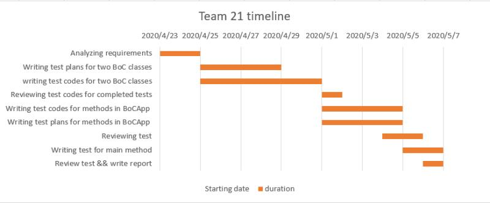

# **Test Report**

## **Contents**
* [Team Management](#team-management)
    * [Introduction](#introduction)
        * [Motivation](#motivation)
        * [Contribution Distributions](#contribution-distributions)
    * [Procedures](#procedures)
        * [Timeline](#1-timeline)
        * [Team Strategies](#2-team-strategies)
        * [Challenges and Solutions](#3-challenges-and-solutions)
        * [Case Study](#4-case-study)
        * [Additional Explanation](#5-additional-explanation)
* [Test Plan](#test-plan)
    * [BoCTransaction](#class-boctransaction)
    * [BoCCategory](#class-boccategory)
    * [BoCApp](#class-bocapp)
* [Conclusion](#conclusion)
* [Acknowledgements](#acknowledgements)

## **Team Management**

### **Introduction**
Last meeting, mediocre developer Louis Litt has just coding away with no plan or agreement for the project with Bank of China (BoC). The codes were checked and considered as a terrible work with its incomplete functionalities. With the purpose of fixing the vulnerable BoCApp code, a team of six was formed to solve the tricky problem as soon as possible. 

In this report, the brief motivation of the project will be illustrated firstly for its meaning of existence. Subsequently, the whole procedure of the project includes nine specific steps. Requirements analysis is the first and important step to clarify the mission and formulate an overview blueprint of the whole project. Then, two BoC classes were dispatched two sub-groups to write the plans and codes for the final test of the main class 'BoCApp'. As for 'BoCApp' class, it has similar achievement methods including writing plans and codes for testing and modifying. After that, the review section could be considered as the connecter between the achieved work and closing work. During this section, some potential errors and feedbacks were found and commented out by two reviewers. Ultimately, the test of the main method and report writing is the summary of the whole project.

Excepting the procedure of teamwork, this report will also proceed from the personal cases to elaborate on the interaction, team strategy, and perspective in detail. Then, the limitations were addressed quantitatively to explore the improvement field of the whole project. Finally, some reflections and reviews of the provided project and our achievements were proposed before the conclusion.


#### Motivation

Since the code written by a member is not in accordance with the standard of Quality Assurance Manager, the development team leader are asking the team to design tests for bad code modifications. First the team needs to make a plan, and then write tests in the order of the plan which follows proper Test-Driven Development expectations. Other principles such as detailed commenting (naming the developers of each function), change history (as comments in code), paired coding, proper use of version control software are also recommended.


#### Contribution Distributions
| Authors | Details |
| --------- | -------- |
| Wangkai JIN | Test plan and test code for method 1-4 of class BoCTransaction<br />Review test codes for BoCCategory<br />Review test codes for 6 methods in BoCApp file<br />Time axis, firgure maker, procedure challenge and Case study 1 writing for Report |
| Yizhou CHEN | Test plan and Test code for method 4-7 in BoCCategory class<br />Test plan and Test code for method 4-6 in BoCApp.java<br />Improvements on method 5-6 in BoCApp.java<br />git folder management<br />Procedure - Challenge, Case study 2, Additional Explanation writing in Report |
| Rongze LI | Test plan and Test code for method 1-3 in BoCCategory class <br /> Test plan and Test code for method 3 in BoCApp.java<br /> Test code for main method <br />Report structure making, introduction and discussion writing in Report |
|Zhihao LI | Test plan and test code for method 9-11 of class BoCTransaction<br /> Review test codes for BoCTransaction<br />Review codes for BoCTransactionTest.java and BoCTransactionTest.md Function 1-11<br />Limitation writing in Report |
| Qicheng CHEN | Test plan and test code for method 5-8 of class BoCTransaction<br />Test plan for method 5-7 of class BoCApp, code modifications on method 4<br />Team strategy, merging report |
| Yuyang LIN | Test plan and Test code for method 8-11 in BoCCategory class<br />Test plan and Test code for method 1-2 in BoCApp.java <br />Test plan for main method in BoCApp.java<br />Improvements on method 1-3 and main method in BoCApp.java<br/>Limitation writing in Report |


### **Procedures**


#### 1. Timeline:

----4.24 First Meeting, topic covered are listed below: 								

1. Analyze the Coursework requirements 
2.  Workload Distribution. The whole team split into two subgroups and each team member  is responsible for writing test files for about 4 methods in average.
3. Set  milestones. After discussion, our team decided to set the first milestone on April 29th the second milestone on May 1st, for which our task is to finish writing test  plans and codes for BoCCategory and BoCTransaction respectively.
4. Set the format for coding and comment style.

----4.29 Second Meeting, 8h before first milestone: 

1. Second call on coding convention. During writing test codes for the two classes, our team found that even we have set the general coding style, everyone's coding style still differed greatly. In this meeting, we set up a more specific style,including how to name test functions, when to use in-line comment, when to use multi-line comment etc.
2. General discussion about how to modify the test plan template. After discussion, our team decided to set attributes of the table that records every test methods as **Description**(describe purpose of each test), **Input**(input in method or initialized variable), **Expected Outpu**t(expected value), **Actual Value**(actual result), **Result**（note down the time of pass/fail and reason to form a testing log column）
3. Call for use **Issue**  functionality on Gitlab for more professional teamwork.

----4.29 24:00 first milestone competed successfully.

----5.1 Third Meeting, 12h before second milestone:

1. Our team  decides to use a specific type to print out the expected and actual value of each test in the console. The format is printed below.

   ```java
   TestremoveExpense2 -> removeExpense(new BigDecimal("0.00"))
   Input: Category with expense 10.00, removeExpense: new BigDecimal("0.00")
   Expected: 10.00
   Actual: 10.00
   ```

   the name before  the arrow indicates the method we are testing and the expression after arrow indicates the exactly way to call this method. The rest three lines print the input, expected output and actual output.  Our team believes by doing so, it could make our tests easier to be examined even to layman and the output are more organized.

----5.1 Fourth Meeting , 7h before second milestone:

1. Check current working stage.  All members have completed task to write test file for methods in BoCCategory/BoCTransaction and have pushed the codes in corresponding branch.
2. Workload Redistribution.  During first week, we found that it is difficult have a unify coding style even we tried very hard to do so and current working pattern may burden the workload for members who are responsible for reviewing codes for everyone. For the second week, our team will split into groups of two,one subgroup will be in charge of **reviewing and merging branches** and the other two subgroups will be responsible for **writing test codes**.(Further explanation can be found in **Team Strategy** section)
3. Plan for next week. Review group are required to review and merge test codes for BoCCategory/BoCTransaction in main before 24:00 May 2nd(Third milestone).  Programming groups are required to write tests for methods in app file before May 4th(Fourth milestone).

----5.1, 24:00 second milestone completed successfully

----5.2, 24:00 third milestone completed successfully

----5.4 fourth milestone failed.  Reset the milestone to May 6th. Reason: 

1. One programming group found parameterized test for junit4 and junit5 are different, therefore they need more time to modify the codes.
2. The other group encountered several unexpected bugs that is not included in test plan, so further tests are still needed.

----5.6 24:00 fourth milestone completed




#### 2. Team Strategies

A team is usually brought together to tackle a difficult task, especially when the workload of the task is desperate for a person. However, a team will need strategies to finish the mission smoothly, or else the work done by the team might end up being not even as good as if the work were done by a single person. 

Initially, in lab 7, we decided to distribute the two classes, BoCTransaction and BoCCategory, as they were the first two classes we needed to test, to all six members in the team. In that manner, every member will have 3 methods to test on average. The idea was simple, everyone will have some work to do and we expected to make the first milestone pretty quickly. But the drawback became quite obvious as we progressed, two classes were tested on six different computers by six different persons, as well as with six different styles of tests. This later raised a significant difficulty for the reviewers, and even before we had “reviewers”, it had already costed more than a week to finish testing the first two classes.

Considering the inefficiency of issuing tasks like this, when we had only a small handful of days left, we decided to make a different plan for the remained one class. Since the inefficiency was mostly found on the six different styled codes, six Java files, we decided to divide into three sub-group, each group with two members, one group is in charge of the review, the other two would take care of the class BoCAPP. In particular, we tried to implement paired coding, the pair of members in the sub group worked on the same java file, when one member was writing tests for the class, at the meantime, the other one should be reviewing the tests written previously for this class, also updating plan and writing new ones. We wanted the three sub-groups to be working in parallel, and it turned out to be more efficient than the previous strategy we made. 


#### 3. Challenges and Solutions
| Challenge                                                    | Solution                                                     |
| ------------------------------------------------------------ | ------------------------------------------------------------ |
| Unify three different coding styles in a test file           | change the comment style,rename every test function with same format and set up variables in the `setup()` function |
| Convert type float to type BigDecimal                        | float needs to be upcasting into a wrapper Number first, then transformed into string by using tostring function. E.g.`new BigDecimal(((Number)newValue).toString())` |
| One condition is missed in method `category()`, if spend >budget, the printed number should be positive and "remaining" should be replaced by "Overspent" | add one more test to test the missing condition and add a  if-statement to the source code, to print "overspent " message |
| One condition is missed in default constructor of BoCCategory. According to class description file, every category should have a unique name and duplication is not allowed. | create a static variable in BoCCategory class as a counter. When defaultly instantiating a new category, the name of category should be "New Category" + counter which guarantees ubiquity |
| after using `System.setout(new PrintStream(outcontent))` to direct the output stream to a print stream, if we need to redirect the output stream to console, expression `System.setOut(System.out)` doesn't work for our purpose. | Create a variable sdout to store default print stream  as `PrintStream stdout = System.out` . Later redirect print stream to stored default stream `System.setout(stdout)`. By doing so, sequential output will be printed in console |
| InvocationTargetException is raised as comparing expected thrown Exceptions | After figuring out the reason why InvocationTargetException occurred, by adding assertThrows to capture it and comparing expected thrown Exceptions by .getCause().getClass() of InvocationTargetException |
| Newline character difference between different OSs    | Replace all of "\n" in the print function by System.lineSeparator() |


#### 4. Case Study

##### Case Study 1, from Wangkai JIN:

This coursework provides us an opportunity to have a taste how a "professional" software-engineering team works.  Since none of the team members has had a group-work project experience before, we do learn a lot from this hands-on experience.

The first lesson I learned is **team work**.  In the first week, our team allocates the tasks to every member equally ---- every one is in charge of writing 3-4 methods. What our understanding right that time was to give every one even work without any thoughts on efficiency or team performance. 


When it comes to review each other's codes, we found that even though we had two meetings call for unified coding style, all six team members still has different coding styles and there own habit about how to write test codes, e.g. someone prefer  to use `@BeforeEach` to initialize some general-used variables before every test functions while someone prefer to initialize variables at the beginning of each function. After spotting this kind of defect of that working pattern, our team held an emergent on-line meeting calling for a more efficient, dynamic and organized working pattern. Through redistribution , our team came up with a plan to divide six members into three subgroups. One group is only responsible of **reviewing peer's code and branch management** while the other two group are only responsible of **developing tests** for different methods(same as the developer role in professional team). The outcome shows that this **agile** way is indeed an efficient approach since three groups can work **simultaneously** ---- programming group can moving on to write test plan for next part while reviewing group is checking any undetected bugs/untested conditions.

Another expressive lesson I learned  during this process is when I am  exploring **advanced functionality** in JUnit. According to the knowledge we learned in lectures, after running JUnit test program, the number of tests that passed or failed can be traced somewhere in IDE. However, rather just to see red crosses for fail or green tick for pass, I was wondering if there are some interfaces/methods that we can implement to monitor every junit test and send more detailed message to user directly. After some time of exploring, Yizhou Chen and I found that a JUnit API, TestWatcher can be used  to collect the status of every test functions and print message in the console. The general implementation is like this 

```java
public class MyTestWatcher implements TestWatcher {
    private static String watchedLog = "";
    @Override
    public void testFailed(ExtensionContext extensionContext, Throwable throwable) { }

    @Override
    public void testSuccessful(ExtensionContext extensionContext) {}
}
```

create an inner class, override several methods to collect information of all the test functions  and finally print out the log to the console. After successfully implemented the API, we found that fancy and advanced as this API is, only a limited information is collected by this API which is not practical at all. In the end, our abandon this approach to show test  status instead simply use a  print format with comparison which is introduced in Time Line section.


##### Case Study 2, from Yizhou CHEN

###### Issue: BoCApp.java Part2 test

###### Work Division:

We learnt a lesson from the work division of BoCCategory and BoCTransaction class last time,
where a whole test code writing task is divided into 3 pieces for each team member, resulting in a very low productivity.<br/>
Consequently, suggested by **Qicheng CHEN**, BoCApp.java method testing is divided into **2 parts**, 1-3 method (```ListTransaction(), CategoryOverview(), ListTransactionsForCategory()```)
and 4-6 method (```ChangeTransactionCategory(), AddTransaction(), AddCategory()```) for two **2 person sub-groups** respectively,
while another sub-group is in charge of peer review.<br/>

The schedule of this issue can be viewed in the timetable below.

| Date |Group 1 (Review)                    | Group 2 (integration testing)                                   | Group 3 (integration testing) |
| ------ |------ |------ | ------ |
| 5/1/2020 |   Review and merge                   | Making test plan                                      | Making test plan |
| 5/2/2020 |    Review and merge (deadline: 24:00) | Making test plan   | Making test plan   |
| 5/3/2020 |   |   |  |
| 5/4/2020 |     |  Finish building tests and all pass (deadline: 24:00)          | Finish building tests and all pass (deadline: 24:00)   |
| 5/5/2020 |   Review and merge (deadline: 24:00)                                    |         |  |
| 5/6/2020 |     |            |                       |
| 5/7/2020 |   Report                              | Report                                                | Report                                               |

<br/>

##### Testing Strategy 
Yizhou CHEN and Qicheng CHEN were assigned to BoCApp.java Part2 testing. So the testing strategies for method 4-6 is mainly covered.

Basically, ChangeTransactionCategory is changing a Transaction from a Category to another one. There are few points need to be awared
 of.<br/>
1)  The ```ChangeTransactionCategory(), AddTransaction() and AddCategory()```are private methods. <br/>The way to access it is given by (ChangeTransactionCategory() is taken for example):<br/> 
    ```java
        BoCApp app = new BoCApp();
        Method m = BoCApp.class.getDeclaredMethod("ChangeTransactionCategory", Scanner.class);
        m.setAccessible(true);
    ```
2)  The type of the parameter of ```ChangeTransactionCategory(), AddTransaction() and AddCategory()``` is ```Scanner```.<br/>
The way to test is pretending keyboard typing by: <br/>
    ```java
        String input = System.lineSeparator()+"Sting"+System.lineSeparator();
        InputStream in = new ByteArrayInputStream(input.getBytes());
        System.setIn(in);
        Scanner scanner = new Scanner(System.in);
        m.invoke(app, scanner);
    ```

3)  The points of testing this method are listed below (ChangeTransactionCategory() is taken for example):<br/>
    1. If the Category of the Transaction is successfully changed<br/>
    2. If the Expense is successfully added to the post-Category<br/>
    3. If the Expense is successfully removed from the pre-Category<br/>
    4. If the Expense is accidentally added to the post-Category in error-occurring scenarios and errors are handled as well<br/>
    5. If the Expense is accidentally removed from the post-Category in error-occurring scenarios and errors are handled as well<br/>

The first try is that using function ```assertSame()``` to compare the equivalence of the expected object and the actual one.<br/>

The second try is that using function ```assertEquals()``` method to compare the equivalence of the pre and post result of calling method ```CategoryOverview()```.<br/>

The third try is that using function ```assertAll``` to include all the ```assertEquals()``` comparing the equivalence of the properties of the expected object and the actual one by accessing to the object directly.<br/>


After implementing these two tries to the testing scenarios, pros and cons for each two tries are revealed as below.

| Implementation     | Result      | Pros      | Cons |
| ----- | --------- | --------- | ----- |
| 1. Directly duplicate a object from the original one<br/>2. Operate expecting actions on the duplicated one<br/>3. Compare the duplicated one and the actual original one        |   Fail:<br/>Reason: Even if the properties between two are the same, but they are not the same object finally.       |  Null        | Null          |
| 1. Calculate the properties of either Categories or Transactions<br/>2. Write expected outputs based on the calculations<br/> 3. Compare the expected outputs with the actual one        |   Success        | 1. Good visualization results<br/> 2. More accurate comparison by the results of calling overview method          | 1. Inconvenient to change expected outputs if unexpected faults occurred<br/>2. Might lead to a delay of work if the test of overview method delays          |
| 1. List all the properties needed to be compared<br/>2. Access targeted objects directly and compare all the listed properties<br/>3. Use assertAll() to include all the compared properties together      |  Success         | 1.Compare all the properties explicitly.<br/>2. Match failing part efficiently.           | 1. Visualization part can't give a overview of a list of tests         |

As is listed above, there are three ways for testing this method. However, the idea of the third try is poped after the end of this testing part. So the final adopted scheme to test this method is **the second one**.

##### Team strategy

First of all, the three Laws of TDD is strictly applied throughout the procedure:
* First law: You may not write production code until you have written a failing unit test
    * Write test first, even if you know it will absolutely fail
* Second law: You may not write more of a unit test than is sufficient to fail, and not compiling is failing
    * One test at a time, do not write the next test before the current one is passed
* Third law: You may not write more production code than is sufficient to pass the currently failing test
    * Only modify or add codes to pass the test

In the procedure of testing BoCApp.java, ```CategoryOverview and ListTransactions``` are fundamental but overarching methods, for my testing strategy choosing these two methods to evaluate results and reveal problems. <br/>
We arrange the first sub-team to quickly complete the testing work of these two methods and make few improvements on them, while review team is then appended to check if potential problems exist and refine coding styles.<br/>
After this, test plan writing for method 4-6 is opened for the second sub-team, and testing work is as proceeded.    

Further, sub-team division strategy reveals the merit of pair-coding perfectly, and shows rather high productivity in the procedure. One writes test plan and commits it to the git branch remotely, while one pulls the plan, write corresponding codes and update the plan with actual outputs and results.<br/>

However, challenges always occurred. 
Challenges occurred in the working procedure and corresponding solutions listed below. Overcoming challenges brings joys of harvets.

| Challenge                                                    | Solution                                                     |
| ------------------------------------------------------------ | ------------------------------------------------------------ |
| InvocationTargetException is raised as comparing expected thrown Exceptions | After figuring out the reason why InvocationTargetException occurred, by adding assertThrows to capture it and comparing expected thrown Exceptions by .getCause().getClass() of InvocationTargetException |
| Newline character difference between different OSs    | Replace all of "\n" in the print function by System.lineSeparator() |

##### Improvable aspects

We spend substantial amounts of time fixing problems caused by carelessly missing conditions requested by Description file. For example, correctness of restricting "value bigger than 0" on the method ```AddTransaction and AddCategory``` should be made ahead of other changes have been made then.  


#### 5. Additional Explanation

As a brand-new project, our understanding of the project is progressively improving. At the beginning of the project, we did not use **issue** properly, for most of our meetings are held without collecting points and summarizing them. Meanwhile, the **code style** is different among the group, resulting in the waste of time misunderstanding codes. **The content of notation and test code** is not refined as well, for no Date and test history recorded. <br/><br/>

However, after our meetings and discussions, most of these problems are addressed. <br/>
1. One team member will be selected to summarize our meeting contributions and submit it to the **issue**, with a timetable for next several days attached.<br/> 
    This is one of our issue look of the summary of a meeting. It is rather clear to see all of our meeting details, new points collection, next stage schedule and notices.<br/>

<br/>

2. **The code style** is uniformed after #issue 20. And **the content of notation and test code** is refined with Date records, author records, detailed explanations and test history records.<br/>
   These are screenshots from the modified main code and test code, which clearly show our improvements on contents and uniformity.<br/>
<br/><br/>
<br/>


### **Limitations**

|      |                         Limitations                          |                Suggestions on improvement                 |
| ---- | :----------------------------------------------------------: | :-------------------------------------------------------: |
| 1    | The process for user input is not very user-friendly. When user gives an invalid input in N or C, the program just gives an error message and back to the main choosing menu, rather than asking the user to input a valid one. |        Improved to the main stucture of the BoCApp        |
| 2    | The app does not provide diffrent types of languages and currencies for users to choose, which cannot be used widely. |          Add more language and currency options           |
| 3    | The app cannot list all the transactions in the order of time (daily, monthly, aunnally), so the users have limited ways to see their transactions. | Add a new method to list transations in the order of time |
| 4    | The app needs to encourage users to set a target for deposit to help them arrange the transactions more clearly. |         Add a new value for adding deposit target         |
| 5    | The app doesn't allow the user to switch to another account or into a multi-account or a joint-account. |                Account setting is required                |
| 6    | In the app the interface is not vivid but textual, which reduces the user's experience. |      Graphical interfaces and UI design are required      |
| 7    | In this system user's data is not safe and easy to be stolen by others. |                  Encryption is required                   |
| 8    | In case data is lost or the user wants to use on another device, it is hard for user to recover the data. |                 Cloud storage is required                 |


### **Discussion**
With the cooperation of six people, the basic mission was achieved. Nevertheless, some restrictions, irrationality, and reflections of current project requirements were observed in the process of implementation, which will have a relative impact on the software.

#### Defective Code Style
The basic mission is functionality improvement based on the provided source codes. Some minor modification was implemented according to the mission requirement. Nevertheless, according to the standardized software code format, simple software lacks flexibility and design of accessible security. BoCCategory class and BoCTransaction class have similarity including member variables and methods. Hence, an interface should be built to decrease code coupling and facilitate change and maintenance. Additionally, the whole codes lack the thinking of security. No restrictions for illegal access will cause data leakage and the hidden danger of use.


#### Redundant 'main method' Test
One part of the mission is testing the main function in 'BoCApp' class, which aims to implement the test of optimized codes. Nevertheless, As the retrospect of the meaning of the main function, it is designed for testing the completeness and security of methods. And in this project, Junit and the main function were used to implement this objective, which has attained a satisfactory result. Hence, testing the main function is redundant. Instead, the combination of such two test methods should be improved for better testing results.


## **Test Plan**


### Class: BoCTransaction
##### (Note: YYYY/MM/DD refers to any date value)

#### Function Name: 1)Default Constructor (void)

| Input    | Expected Output                                              | Actual Output                                                | Result(Pass/Fail)                                            | Description                            |
| -------- | ------------------------------------------------------------ | ------------------------------------------------------------ | ------------------------------------------------------------ | -------------------------------------- |
| no input | Name = “[Pending Transaction]”<br />Category = 0 (unknown, default initialization) | (Date:29/04/2020)<br/>Name = Null,Category =0<br/><br/>(Date:03/05/2020)<br/>Name = [Pending Transaction], Category = 0 | Fail:(Date: 29/4/2020)  Reason:when initializing variable Name, the primary function<br/>Pass:(Date:03/05/2020)source code is modified to initialize transactionName with [Pending Transaction] | test if default constructor works fine |

#### Function Name: 2) public BoCTransaction(String tName, BigDecimal tValue, int tCat)

| Input                                                       | Expected Output                                              | Actual Output                                                | Result (Pass/Fail)                                           | Description                                                  |
| ----------------------------------------------------------- | ------------------------------------------------------------ | ------------------------------------------------------------ | ------------------------------------------------------------ | ------------------------------------------------------------ |
| ("Rent", new BigDecimal("850.00"), 0)                       | create an instance with Name = "Rent", Value = 850.00(BigDecimal), Category = 0, Time = time created | (Date:29/04/2020)<br/>Name = "Rent",Value = 850.00,Category =0 | Pass: (Date 29/4/2020) Reason :the input is what exactly defined | test if the constructor works correctly with  expected input |
| ("ABCDEFGHIJKLMNOPQRSTUVWXYZ", new BigDecimal("850.00"), 0) | create an instance with Name = "ABCDEFGHIJKLMNOPQRSTUVWXY", Value = 850.00(BigDecimal), Category = 0, Time = time created | (Date:29/04/2020)<br/>Name = "ABCDEFGHIJKLMNOPQRSTUVWXYZ", Value = 850.00(BigDecimal), Category = 0, Time = time created<br/><br/>(Date:03/05/2020)<br/>Name = "ABCDEFGHIJKLMNOPQRSTUVWXY", Value = 850.00(BigDecimal), Category = 0, Time = time created<br/> | Fail: (Date 29/4/2020)  Reason: the method doesn't check whether the name is more than 25 characters<br/>Pass(Date:03/05/2020) Source code is modified to limit the length of name | test if the main constructor failed with Name longer than 25 characters |
| ("Rent", new BigDecimal("-2"), 0)                           | create an instance with Name = "Rent", Value = 0(BigDecimal), Category = 0, Time = time created | (Date:29/04/2020)<br/>Name = "Rent",Value = -2, Category =0<br/><br/>(Date:03/05/2020)<br/>Name = "Rent",Value = 0.01, Category =0<br/> | Fail: (Date 29/4/2020) Reason: the constructor doesn't check whether the value is negative or not<br/>Pass(Date:03/05/2020) The transactionValue is limited to be positive | test if the main constructor failed with negative value      |

#### Function Name: 3) public String transactionName()

| Input                                                        | Expected Output | Actual Output | Result (Pass/Fail)                                           | Description                                      |
| ------------------------------------------------------------ | --------------- | ------------- | ------------------------------------------------------------ | ------------------------------------------------ |
| System.out.print(new BoCTransaction("Rent", new BigDecimal("850.00"), 0).transactionName()) | Rent            | Rent          | pass:(Date: 30/4/2020) Reason: the input types and numbers are expected and the method is called correctly | test if the method return the name of the object |
|                                                              |                 |               |                                                              |                                                  |

#### Function Name: 4) public BigDecimal transactionValue() 

| Input                            | Expected Output | Actual Output | Result (Pass/Fail) | Description |
| --------------- | ------------- | ------------------ | ----- | ----- |
| System.out.print(new BoCTransaction("Rent", new BigDecimal("850.00"), 0).transactionName()) | 850.00 | (Date: 30/4/2020)<br/>850.00 | Pass: (Date: 30/4/2020) Reason: the input types and numbers are expected and the method is called correctly | test if the method return the value of the object |

#### Function Name: 5) transactionCategory()

| Input                                                  | Expected Output            | Actual Output                                    | Result (Pass/Fail)                                                      | Description                                                                                                                                                          |
| ------------------------------------------------------ | -------------------------- | ------------------------------------------------ | ----------------------------------------------------------------------- | -------------------------------------------------------------------------------------------------------------------------------------------------------------------- |
| 1.BoCTransaction()                                     | transactionCategory()->0   | (Date: 04/30/2020)<br>transactionCategory()->0   | Pass(Date: 04/30/2020)<br>The actual output matches the expected output | If the class is instantiated with the defaul constructor(no argument passed in),  the method is expeceted to return the category as 0,  the unknown category         |
| 1.BoCTransaction("Lunch", new 2.BigDecimal("20"), 1)   | transactionCategory()->1   | (Date: 04/30/2020)<br>transactionCategory()->1   | Pass(Date: 04/30/2020)<br>The actual output matches the expected output | If the class is instantiated with  the main constructor with arguments ("Lunch", 20, 1),  the method is expeceted to return the category as 1,  the unknown category |
| 1.BoCTransaction("Lunch", new 2.BigDecimal("20"), 300) | transactionCategory()->300 | (Date: 04/30/2020)<br>transactionCategory()->300 | Pass(Date: 04/30/2020)<br>The actual output matches the expected output | Same as above, category as 300                                                                                                                                       |
| 1.BoCTransaction("Dinner", new 2.BigDecimal("20"), 0)  | transactionCategory()->0   | (Date: 04/30/2020)<br>transactionCategory()->0   | Pass(Date: 04/30/2020)<br>The actual output matches the expected output | Same as above, but category as 0, the unknown category                                                                                                               |

#### Function Name: 6) transactionTime()

| Input                                                  | Expected Output                 | Actual Output                                         | Result (Pass/Fail)                                           | Description                                                  |
| ------------------------------------------------------ | ------------------------------- | ----------------------------------------------------- | ------------------------------------------------------------ | ------------------------------------------------------------ |
| 1.BoCTransaction()                                     | transactionTime()->Date created | (Date: 04/30/2020)<br>transactionTime()->Date created | Pass(Date: 04/30/2020)<br>transactionTime() returned Date created, which matches the expected output | If the class is instantiated with  the default constructor, it  should return the time created |
| 1.BoCTransaction("Lunch", new 2.BigDecimal("20"), 1)   | transactionTime()->Date Object  | (Date: 04/30/2020)<br>transactionTime()->Date Object  | Pass(Date: 04/30/2020)<br>transactionTime() returned a Date Object, which matches the expected output | If the class is instantiated with  the main constructor with arguments ("Lunch", 20, 1),  the method should return whatever the date value was when the transaction took place |
| 1.BoCTransaction("Unknown", new 2.BigDecimal("30"), 2) | transactionTime()->Date Object  | (Date: 04/30/2020)<br>transactionTime()->Date Object  | Pass(Date: 04/30/2020)<br>transactionTime() returned a Date Object, which matches the expected output | Same as above, argument as ("Unknown", 30, 2)                |

#### Function Name: 7) setTransactionName()

| Input                                                                                                               | Expected Output                           | Actual Output                                                                                                                                         | Result (Pass/Fail)                                                                                                                                                                                                                                                                                                                                                            | Description                                                                                                                                                                                                  |
| ------------------------------------------------------------------------------------------------------------------- | ----------------------------------------- | ----------------------------------------------------------------------------------------------------------------------------------------------------- | ----------------------------------------------------------------------------------------------------------------------------------------------------------------------------------------------------------------------------------------------------------------------------------------------------------------------------------------------------------------------------- | ------------------------------------------------------------------------------------------------------------------------------------------------------------------------------------------------------------ |
| 1.BoCTransaction()<br>2.setTransactionName("Dinner")                                                                | transactionName()-> "Dinner"              | (Date: 04/30/2020)<br>transactionName()-> "Dinner"                                                                                                    | Pass(Date: 04/30/2020)<br>transactionName() returned "Dinner", which matches the expected output                                                                                                                                                                                                                                                                              | Assuming the class is instantited with the default constructor. If the method is called with string "Dinner", when transactionName() is called, transactionName() should return "Dinner"                     |
| 1.BoCTransaction()<br>2.setTransactionName("Unexpected Recovery")                                                   | transactionName()-> "Unexpected Recovery" | (Date: 04/30/2020)<br>transactionName()-> "Unexpected Recovery"                                                                                       | Pass(Date: 04/30/2020)<br>transactionName() returned "Unexpected Recovery", which matches the expected output                                                                                                                                                                                                                                                                 | Same as above, argument as string "Unexpected Recovery"                                                                                                                                                      |
| 1.BoCTransaction()<br>2.setTransactioName(null)                                                                     | transactionName()-> null                  | (Date: 04/30/2020)<br>transactionName()-> null                                                                                                        | Pass(Date: 04/30/2020)<br>transactionName() returned null, which matches the expected output                                                                                                                                                                                                                                                                                  | Same as above, the method is called with value null                                                                                                                                                          |
| 1.BoCTransaction()<br>2.setTransactionName("1235&^%#$545")                                                          | transactionName()-> "1235&^%#$545"        | (Date: 04/30/2020)<br>transactionName()-> "1235&^%#$545"                                                                                              | Pass(Date: 04/30/2020)<br>transactionName() returned "1235&^%#$545", which matches the expected output                                                                                                                                                                                                                                                                        | Same as above, argument as string "1235&^%#$545"                                                                                                                                                             |
| 1.BoCTransaction()<br>2.setTransactionName("1235&^%#$545")<br>3.setTransactionName("Lunch again")                   | Exception                                 | (Date: 04/30/2020)<br>AssertionFailedError: Expected java.lang.Exception to be thrown, but nothing was thrown.<br><br>(Date: 04/30/2020)<br>Exception | Fail(Date: 04/30/2020)<br>expect an exception when try to set the transaction name twice but no exception was thrown<br><br>Pass(Date: 04/30/2020)<br>Expect an exception and was exception thrown after adding a conditional block in setTransactionName() which throws exception when transactionName is not null                                                           | If the class is instantiated with the defaul constructor, then if the name is fisrth set to "1235&^%#$545" then set to "Lunch again", an exception should be thrown as that the name can only be set once    |
| 1.BoCTransaction()<br>2.setTransactionName("This is a string that is longer than the limit length which is 25")<br> | "This is a string that is "               | Date(04/30/2020):<br>"This is a string that is longer than<br>the limit length which is 25"<br><br>Date(04/30/2020):<br>"This is a string that is "   | Fail(Date: 04/30/2020)<br>expect transactionName to return the first 25 characters but the entire string was returned<br><br>Pass(Date:04/30/2020)<br>expect transactionName to return the first 25 chars and the first 25 chars were returned. A conditional block was added in setTransactionName() to take the first 25 characters when tName is longer than 25 characters | If the class is instantiated with the defaul constructor, then if the name is fisrth set to "This is a string that is longer than the limit length which is 25", an exception is expected because the name c |

#### Function Name: 8) setTransactionValue()

| Input                                                                                                                     | Expected Output                     | Actual Output                                                                                                      | Result (Pass/Fail)                                                                                                                                                                                                                                                                                          | Description                                                                                                                                                                                       |
| ------------------------------------------------------------------------------------------------------------------------- | ----------------------------------- | ------------------------------------------------------------------------------------------------------------------ | ----------------------------------------------------------------------------------------------------------------------------------------------------------------------------------------------------------------------------------------------------------------------------------------------------------- | ------------------------------------------------------------------------------------------------------------------------------------------------------------------------------------------------- |
| 1\. BoCTransaction()<br>2\. setTransactionValue(new BigDecimal("200"))                                                    | transactionValue()-> BigDecimal 200 | (Date: 04/30/2020)<br>transactionValue()-> BigDecimal 200                                                          | Pass(Date: 04/30/2020)<br>Expect BigDecimal 200 and a Big Decimal 200 was returned                                                                                                                                                                                                                          | Assuming the class is instantited with the default constructor. If the method is called with BigDecimal 200, when transactionValue() is called, transactionValue() should return a BigDecimal 200 |
| 1\. BoCTransaction()<br>2\. setTransactionValue(new BigDecimal("3.213"))                                                  | transactionValue()-> 3.213          | (Date: 04/30/2020)<br>transactionValue()-> BigDecimal 3.213                                                        | Pass(Date: 04/30/2020)<br>Expect BigDecimal 3.213 and a Big Decimal 3.213 was returned                                                                                                                                                                                                                      | Same as above, arugment as floating point number 3.213                                                                                                                                            |
| 1\. BoCTransaction()<br>2\. setTransactionValue(new BigDecimal("45321897"))                                               | transactionValue()-> 45321897       | (Date: 04/30/2020)<br>transactionValue()-> BigDecimal 45321897                                                     | Pass(Date: 04/30/2020)<br>Expect BigDecimal 45321897 and a Big Decimal 45321897 was returned                                                                                                                                                                                                                | Same as above, arugment as integer 45321897                                                                                                                                                       |
| 1\. BoCTransaction()<br>2\. setTransactionValue(new BigDecimal("-500"))                                                   | transactionValue()-> null           | (Date: 04/30/2020)<br>transactionValue()->null                                                                     | Pass(Date: 04/30/2020)<br>Expect null and null was returned                                                                                                                                                                                                                                                 | Same as above, but argument as BigDecimal -500, which is smaller than 0 and transactionValue should not be modified, which should be null                                                         |
| 1\. BoCTransaction()<br>2\. setTransactionValue(new BigDecimal("200"))<br>3\. setTransactionValue(new BigDecimal("1000")) | Exception                           | (Date: 04/30/2020)<br>AssertionFailedError: Expected java.lang.Exception to be thrown, but nothing was thrown.<br> | Fail(Date: 04/30/2020)<br>Expect an exception when try to set transactionValue twice, but no exception thrown<br><br>Pass(Date: 04/30/2020)<br>Expect an exception and an exception was thrown. A conditional block was added in setTransactionValue() to throw exception when transactionValue is not null | If try to call setTransactionValue() twice with valid inputs, an exception should be thrown at the second call because the transactionValue can be set only once                                  |

#### Function Name: 9) setTransactionCategory()

| Input | Expected Output         | Actual Output            | Result (Pass/Fail)          | Description                        |
| ----- | ----------------------- | ------------------------ | --------------------------- | ---------------------------------- |
| 0     | 0                       | (Date: 05/01/2020)<br/>0 | Pass(Date: 05/01/2020)<br/> | test when input is 0 or by default |
| 1     | transactioncategory()=1 | (Date: 05/01/2020)<br/>1 | Pass(Date: 05/01/2020)<br/> | test when input is 1               |

#### Function Name: 10) isComplete（）

| Input                               | Expected Output | Actual Output                | Result (Pass/Fail)          | Description                                                  |
| ----------------------------------- | --------------- | ---------------------------- | --------------------------- | ------------------------------------------------------------ |
| BoCTransaction();                   | false           | (Date: 05/01/2020)<br/>false | Pass(Date: 05/01/2020)<br/> | test when there is no input                                  |
| BoCTransaction("Food",10,1);        | true            | (Date: 05/01/2020)<br/>true  | Pass(Date: 05/01/2020)<br/> | test when transactionName is "Food", transactionValue is 10, transactionCategory is 1 |
| BoCTransaction("Breakfast",3000,1); | true            | (Date: 05/01/2020)<br/>true  | Pass(Date: 05/01/2020)<br/> | test when transactionName is "Breakfast", transactionValue is 3000, transactionCategory is 1 |
| BoCTransaction("Supper",0.5,1);     | true            | (Date: 05/01/2020)<br/>true  | Pass(Date: 05/01/2020)<br/> | test when transactionName is "Supper", transactionValue is 0.5, transactionCategory is 1 |

#### Function Name: 11) toString()

| Input                            | Expected Output                                   | Actual Output                                                | Result (Pass/Fail)                                           | Description                                                  |
| -------------------------------- | ------------------------------------------------- | ------------------------------------------------------------ | ------------------------------------------------------------ | ------------------------------------------------------------ |
| BoCTransaction();                | toString()="[Pending Transaction] - ￥0.00(Date)" | (Date: 05/01/2020)<br/>Error<br/><br/>(Date: 05/03/2020)<br/>[Pending Transaction] - ￥0.00(Date) | Error(Date: 05/01/2020)<br/>Exception management of null is not dealt with.<br/>Pass(Date: 05/03/2020)<br/>The default constructor is modified to initialize the correct name with [Pending Transaction], value with new BigDecimal("0.00") and Date with created date | test when create a BoCTransaction by default constructor     |
| BoCTransaction("Food",10,1);     | toString()="Food - ￥10(Date)"                    | (Date: 05/01/2020)<br/>Food - ￥10<br/><br/>(Date: 05/03/2020)<br/>Food - ￥10 (Date) | Fail(Date: 05/01/2020)<br/>Reason: function doesn't return the Date<br/>Pass(Date: 03/05/2020) The source code is modified | test when BoCTransaction contains correct transactionName, BigDecimal and transactionValue |
| BoCTransaction("Drink",100,1);   | toString()="Drink - ¥100(Date)"                   | (Date: 05/01/2020)<br/>Drink - ￥100<br/><br/>(Date: 05/03/2020)<br/>Drink - ￥100 (Date) | Fail(Date: 05/01/2020)<br/>Reason: function doesn't return the Date<br/>Pass(Date: 05/03/2020) The source code is modified | test when BoCTransaction contains correct transactionName, BigDecimal and transactionValue |
| BoCTransaction("Transport",1,2); | toString()="Transport - ¥1(Date)"                 | (Date: 05/01/2020)<br/>Transport - ￥1<br/><br/>(Date: 05/03/2020)<br/>Transport - ￥1(Date) | Fail(Date:05/01/2020)<br/>Value determination is expected<br/>Pass(Date:05/03/2020) The source code is modified | test when BoCTransaction contains correct transactionName, BigDecimal and transactionValue |


### Class: BoCCategory 
##### (Note: YYYY/MM/DD refers to any date value)

#### 1) Constructor() 

| Description                                                  | Input               | Expected Output                                              | Actual Output                                                | Result(Pass/Fail)                                            |
| ------------------------------------------------------------ | ------------------- | ------------------------------------------------------------ | ------------------------------------------------------------ | ------------------------------------------------------------ |
| test default constructor (void input) and the length of default CategoryName | no input            | create an instance with Name = New Category<br/>Budget = 0.00<br/>Spend = 0.00<br/> | Name = New Category<br/>Budget = 0.00<br/>Spend = 0.00<br/>  | Pass:(Date 1/5/2020)<br/>Reason: the input is what exactly defined |
| test constructor with one input (String length <= 15)        | "Social"            | create an instance with Name = Social<br/>Budget = 0.00<br/>Spend = 0.00 | Name = Social<br/>Budget = 0.00<br/>Spend = 0.00             | Pass:(Date 1/5/2020)<br/>Reason: the input is what exactly defined |
| test constructor with one input (String length > 15)         | "AVeryLongCategory" | create an instance with Name = AVeryLongCatego<br/>Budget = 0.00<br/>Spend = 0.00 | Name = AVeryLongCategory<br/>Budget = 0.00<br/>Spend = 0.00  | Fail:(Date 1/5/2020)<br/>Reason: the constructor doesn't check whether the name is more than characters<br />Pass: (Date:2/5/2020)   Reason: use a if-statement to check whether the name is more than 16 characters, if the name exceeds the limit, the program will cut off the extra part to fit the limit |
| test if instantiating two default constructors, whether the two instance have different default name | no input            | BoCCategory DefaultConstructor2 = new BoCCategory();<br/>		BoCCategory DefaultConstructor3 = new BoCCategory(); | DefaultConstructor2.Name = New Category0, DefaultConstructor3.Name = New Category1 | Pass:(Date:6/5/2020)  Reason: use a static variable added in the last position of name to differentiate default names |

#### Function Name: 2) public String CategoryName()

| Description                                      		| Input                      | Expected Output 										   | Actual Output | Result (Pass/Fail) | 
| ------------------------------------------------ 		|--------------------------- | --------------- 										   | ------------- | ------------------ |
| test if the method return CategoryName without input  | no input					 | create an instance with Name = New Category		       | Name = New Category              |  Pass:(Date 1/5/2020)<br/>Reason: The method was called correctly                  | 

​                                

#### Function Name: 3) public BigDecimal CategoryBudget()

| Description                                            | Input                | Expected Output 										  | Actual Output | Result (Pass/Fail) | 
| ------------------------------------------------ 		 |--------------------- | --------------- 										  | ------------- | ------------------ | 
| test if the method return CategoryBudget without input | no input 			| create an instance with Budget = 0.00  										  | Budget = 0.00              | Pass:(Date 1/5/2020)<br/>Reason: The method was called correctly                   |       


#### Function Name: 4) public BigDecimal CategorySpend() 

| Description                                            | Input                | Expected Output                                           | Actual Output | Result (Pass/Fail) |
| ------------------------------------------------          |--------------------- | --------------------------------------------------------| ------------- | ------------------ |
| test if the method return CategorySpend without input  | no input             | CategorySpend                                            | CategorySpend              |    Pass  (Date:1/5/2020)  Reason: the input is what exactly defined    |


​                     

#### Function Name: 5) public void setCategoryName(String newName)

| Description                                                          |    Input            | Expected Output                                                                                               | Actual Output | Result (Pass/Fail) |
| --------------------------------                                       | --------------- | -------------                                                                                                 | ------------- | ------------------ |
| test if the method sets CategoryName properly with a String length <=15  | "newName"       | Name =  "newName"                                                                       |   CategoryName = "newName"           | Pass:(Date:1/5/2020)  Reason: the input is what exactly defined |
| test if the method fails with a String input length > 15  | "AVeryLongCategory"       |  Name = "AVeryLongCatego"                                                    |  CategoryName = "AVeryLongCategory"             | Fail: (Date:1/5/2020)Reason: the method doesn't check the length of input String<br />Pass:(Date: 2/5/2020)  Reason : cut off the extra characters |


#### Function Name: 6) public void setCategoryBudget(Float newValue)

| Description                                                                        |    Input                         | Expected Output                                | Actual Output         | Result (Pass/Fail) |
| --------------------------------------------------------------------------------| ---------------              | -------------                                  | ------------------ | ------------------ |
| test if the method sets CategoryBudget properly with a float input >= total spend        | 100.00f       | The value of CategoryBudget is set to 100.00f| Error: The method setCategoryBudget(BigDecimal) in the type BoCCategory is not applicable for the arguments (float)                 |  Fail (Date:1/5/2020)  Reason: type conflict<br />Pass: (Date: 2/5/2020)  Reason: change  the input type to float and cast them into BigDecimal type. Then assign to budget  |
| test if the method fails with a float input < total spend      | budget:0.01f spend:99       | The value of CategoryBudget is set to 0.01f |  Error: The method setCategoryBudget(BigDecimal) in the type BoCCategory is not applicable for the arguments (float) | Fail (Date:1/5/2020) Reason: type conflict<br />Pass:(Date:2/5/2020) Reason: same as above |
| test if the method fails with a BigDecimal input                                        | new BigDecimal("1.00")                             | Error: The method setCategoryBudget(float) in the type BoCCategory is not applicable for the arguments (BigDecimal)|  CategoryBudget is set to BigDecimal("1.00")                  |  Fail (Date:1/5/2020) Reason: type conflict<br />Pass:(Date:2/5/2020) Reason: same as above  |

#### Function Name: 7) public void addExpense(BigDecimal valueToAdd)

| Description                                                                        |    Input                  | Expected Output                          | Actual Output | Result (Pass/Fail) |
| --------------------------------                                                    | ---------------       | -------------                            | --------------| ------------------ |
| test if the method adds a positive value Category spend | Category with expense 100.00, input for method :new BigDecimal("1.00") | The value of CategorySpend is added by 1 | The value of CategorySpend is added by 1              | Pass (Date:1/5/2020) Reason: the input is what exactly defined |
| test if the method fails with a negative input | new BigDecimal("-1.00")| Fail: The method addExpense(BigDecimal) in the type BoCCategory didn't check whether the input is less than zero | The value of CategorySpend is subtracted by 1              | Fail (Date:1/5/2020)Reason: The method doesn't check if the expense is <0<br />Pass:(Date:2/5/2020)  Reason: method is changed to ignore negative input |

#### Function Name: 8) public void removeExpense(BigDecimal valueToRemove)

| Description                                                                        |    Input                  | Expected Output | Actual Output | Result (Pass/Fail) |
| --------------------------------                                                    | ---------------       | -------------   | ------------------ | ----- |
| test if the method removes the input (BigDecimal number > 0) to CategorySpend            | Category with expense 10.00, removeExpense: new BigDecimal("1.00") | The value of CategorySpend is 9 | Spend = 9 | Pass:(Date: 1/5/2020) Reason: the input is what exactly defined |
| test if the method removes the input (BigDecimal number = 0) to CategorySpend            | Category with expense 10.00, removeExpense: new BigDecimal("1.00") | The value of CategorySpend is 10 | Spend =  10 | Pass: (Date:1/5/2020) Reason: the input is what exactly defined |
| test if the method removes the input (BigDecimal number < 0) to CategorySpend            | new BigDecimal("-1.00")| The program prompts a message saying the input can't be negative | Spend = 11 | Fail: (Date: 1/5/2020)   Reason: logic error. the spend to be removed cannot be negative<br />Pass:(Date: 2/5/2020)  Reason: the method is edited to prompt a error message saying input can't be negative |
| test if the method fails when the total spend is less than 0 after removing            | Category with expense 0.00, removeExpense: new BigDecimal("1.00") | The program prompts a message saying the total spend cannot  be zero | Spend = -1 | Fail: (Date:1/5/2020)Reason: logic error. the spend to be removed cannot be negative<br />Pass:(Date: 2/5/2020)  Reason: the method is edited to prompt a error message saying spend can't be negative |


#### Function Name: 9) public void resetBudgetSpend()

| Description                                                                        |    Input                  | Expected Output | Actual Output | Result (Pass/Fail) |
| --------------------------------                                                    | ---------------       | -------------   | ------------------ | ----- |
| test if the method CategorySpend is reset without input                           | Category with expense 200.00, no inputs for method |  CategorySpend is reset to "0.00" | Spend = 0 | Pass:(Date 1/5/2020) |


#### Function Name: 10) public BigDecimal getRemainingBudget()

| Description                                                            |    Input                  | Expected Output | Actual Output | Result (Pass/Fail) |
| --------------------------------                                       | ---------------       | -------------   | ------------------ | ----- |
| test if the method returns remainingBudget                           | Category with budget 250, spend 200, no inputs for method | 50              | 50 | Pass:(Date:1/5/2020) |


#### Function Name: 11) public String toString()

| Description                                                            |    Input                  | Expected Output | Actual Output | Result (Pass/Fail) |
| --------------------------------                                       | ---------------       | -------------   | ------------------ | ----- |
| test if the method returns name, budget and spend of category       | Category with default name, value budget and spend is 0, no input for method | [New Category] (Budget:¥0.00) - ¥0.00 (¥0.00 Remaining) | New Category(¥0.00) - Est. ¥0.00 (¥0.00 Remaining) | Fail:(Date:1/5/2020) Reason : print format is wrong <br /><br />Pass: (Date:2/5/2020)   Reason: the output is expected |
| test if the method will print the overspent money | Category with default name, value budget(20f) and spend 40 BigDecimal, overspent amount 20.00, no input for method | [New Category](Budget:¥20.0) - ¥40.00 (¥20.00 Overspent) | New Category(¥0.00) - Est. ¥0.00 (¥0.00 Remaining) | Fail:(Date:2/5/2020)  Reason: print format is wrong<br /><br />Pass: (Date:2/5/2020)   Reason: the output is expected |


### Class: BoCApp

#### Function Name: 1) main(String[] args) 

| Input                                                        | Expected Output                                              | Actual Output                                                | Result (pass/fail)                                           | Description                                                  |
| ------------------------------------------------------------ | ------------------------------------------------------------ | ------------------------------------------------------------ | ------------------------------------------------------------ | ------------------------------------------------------------ |
| 1\. X (Exit)                                                 | 1.<br>1) Unknown (Budget:¥0.00) - ¥850.00 (¥850.00 Overspent)<br>2) Bills (Budget:¥120.0) - ¥112.99 (¥7.01 Remaining)<br>3) Groceries (Budget:¥75.0) - ¥31.00 (¥44.00 Remaining)<br>4) Social (Budget:¥100.0) - ¥22.49 (¥77.51 Remaining)  <br><br>What do you want to do?<br>T = List All [T]ransactions, [num] = Show Category [num], A = [A]dd Transaction, X = E[x]it  <br><br> 2.<br>Goodbye!<br><br> | <br> 1.<br>1) Unknown (Budget:¥0.00) - ¥850.00 (¥850.00 Overspent)<br>2) Bills (Budget:¥120.0) - ¥112.99 (¥7.01 Remaining)<br>3) Groceries (Budget:¥75.0) - ¥31.00 (¥44.00 Remaining)<br>4) Social (Budget:¥100.0) - ¥22.49 (¥77.51 Remaining)  <br><br>What do you want to do?<br>T = List All [T]ransactions, [num] = Show Category [num], A = [A]dd Transaction, X = E[x]it  <br><br> 2.<br>Goodbye!<br><br> | **Pass(Date: 05/06/2020)**<br>                               | Exit directly                                                |
| 1\. T (Transaction)<br>2\. X (Exit)                          | 1.<br>1) Unknown (Budget:¥0.00) - ¥850.00 (¥850.00 Overspent)<br>2) Bills (Budget:¥120.0) - ¥112.99 (¥7.01 Remaining)<br>3) Groceries (Budget:¥75.0) - ¥31.00 (¥44.00 Remaining)<br>4) Social (Budget:¥100.0) - ¥22.49 (¥77.51 Remaining)  <br><br>What do you want to do?<br>T = List All [T]ransactions, A = [A]dd Transaction, [num] = Show Category [num], X = E[x]it  <br><br> 2.<br>1) Rent (Unknown) - ¥850.00<br>2) Phone Bill (Bills) - ¥37.99<br>3) Electricity Bill (Bills) - ¥75.00<br>4) Sainsbury's Checkout (Groceries) - ¥23.76<br>5) Tesco's Checkout (Groceries) - ¥7.24<br>6) RockCity Drinks (Social) - ¥8.50<br>7) The Mooch (Social) - ¥13.99<br><br>What do you want to do?<br>O = [O]verview, T = List All [T]ransactions, [num] = Show Category [num], C = [C]hange Transaction Category, A = [A]dd Transaction, N = [N]ew Category, X = E[x]it <br><br> 3.<br>Goodbye! | 1.<br>1) Unknown (Budget:¥0.00) - ¥850.00 (¥850.00 Overspent)<br>2) Bills (Budget:¥120.0) - ¥112.99 (¥7.01 Remaining)<br>3) Groceries (Budget:¥75.0) - ¥31.00 (¥44.00 Remaining)<br>4) Social (Budget:¥100.0) - ¥22.49 (¥77.51 Remaining)  <br><br>What do you want to do?<br>T = List All [T]ransactions, [num] = Show Category [num], A = [A]dd Transaction, X = E[x]it  <br><br> 2.<br>1) Rent (Unknown) - ¥850.00<br>2) Phone Bill (Bills) - ¥37.99<br>3) Electricity Bill (Bills) - ¥75.00<br>4) Sainsbury's Checkout (Groceries) - ¥23.76<br>5) Tesco's Checkout (Groceries) - ¥7.24<br>6) RockCity Drinks (Social) - ¥8.50<br>7) The Mooch (Social) - ¥13.99<br><br>What do you want to do?<br>O = [O]verview, T = List All [T]ransactions, [num] = Show Category [num], C = [C]hange Transaction Category, A = [A]dd Transaction, N = [N]ew Category, X = E[x]it <br><br> 3.<br>Goodbye! | **Pass(Date: 05/06/2020)**<br>                               | Check transaction and exit                                   |
| 1\. O (Overview)<br/>2\. X (Exit)                            | 1.<br> 1) Unknown (Budget:¥0.00) - ¥850.00 (¥850.00 Overspent)<br> 2) Bills (Budget:¥120.0) - ¥112.99 (¥7.01 Remaining)<br> 3) Groceries (Budget:¥75.0) - ¥31.00 (¥44.00 Remaining)<br> 4) Social (Budget:¥100.0) - ¥22.49 (¥77.51 Remaining)<br> <br> What do you want to do?<br> T = List All [T]ransactions, [num] = Show Category [num], A = [A]dd Transaction, X = E[x]it<br> <br>2.<br> 1) Unknown (Budget:¥0.00) - ¥850.00 (¥850.00 Overspent)<br> 2) Bills (Budget:¥120.0) - ¥112.99 (¥7.01 Remaining)<br> 3) Groceries (Budget:¥75.0) - ¥31.00 (¥44.00 Remaining)<br> 4) Social (Budget:¥100.0) - ¥22.49 (¥77.51 Remaining)<br> <br> What do you want to do?<br> O = [O]verview, T = List All [T]ransactions, [num] = Show Category [num], C = [C]hange Transaction Category, A = [A]dd Transaction, N = [N]ew Category, X = E[x]it<br> <br>3.<br> Goodbye!<br> | 1.<br/> 1) Unknown (Budget:¥0.00) - ¥850.00 (¥850.00 Overspent)<br/> 2) Bills (Budget:¥120.0) - ¥112.99 (¥7.01 Remaining)<br/> 3) Groceries (Budget:¥75.0) - ¥31.00 (¥44.00 Remaining)<br/> 4) Social (Budget:¥100.0) - ¥22.49 (¥77.51 Remaining)<br/> <br/> What do you want to do?<br/> T = List All [T]ransactions, [num] = Show Category [num], A = [A]dd Transaction, X = E[x]it<br/> <br/>2.<br/> 1) Unknown (Budget:¥0.00) - ¥850.00 (¥850.00 Overspent)<br/> 2) Bills (Budget:¥120.0) - ¥112.99 (¥7.01 Remaining)<br/> 3) Groceries (Budget:¥75.0) - ¥31.00 (¥44.00 Remaining)<br/> 4) Social (Budget:¥100.0) - ¥22.49 (¥77.51 Remaining)<br/> <br/> What do you want to do?<br/> O = [O]verview, T = List All [T]ransactions, [num] = Show Category [num], C = [C]hange Transaction Category, A = [A]dd Transaction, N = [N]ew Category, X = E[x]it<br/> <br/>3.<br/> Goodbye!<br/> | **Pass(Date: 05/06/2020)**<br/>                              | Check category overview and exit                             |
| 1\. T (Transaction)<br/>2\. C (Change Transaction Category)<br>3. 2<br>4. 2<br>5. X (Exit) | 1.<br />1) Unknown (Budget:¥0.00) - ¥850.00 (¥850.00 Overspent)<br/>2) Bills (Budget:¥120.0) - ¥112.99 (¥7.01 Remaining)<br/>3) Groceries (Budget:¥75.0) - ¥31.00 (¥44.00 Remaining)<br/>4) Social (Budget:¥100.0) - ¥22.49 (¥77.51 Remaining)<br/><br/>What do you want to do?<br/> T = List All [T]ransactions, [num] = Show Category [num], A = [A]dd Transaction, X = E[x]it<br/><br />2.<br/>1) Rent (Unknown) - ¥850.00<br/>2) Phone Bill (Bills) - ¥37.99<br/>3) Electricity Bill (Bills) - ¥75.00<br/>4) Sainsbury's Checkout (Groceries) - ¥23.76<br/>5) Tesco's Checkout (Groceries) - ¥7.24<br/>6) RockCity Drinks (Social) - ¥8.50<br/>7) The Mooch (Social) - ¥13.99<br/><br/>What do you want to do?<br/> O = [O]verview, T = List All [T]ransactions, [num] = Show Category [num], C = [C]hange Transaction Category, A = [A]dd Transaction, N = [N]ew Category, X = E[x]it<br/>C<br/>Which transaction ID?<br/><br />3.<br/>	- Phone Bill - ¥37.99 Wed May 06 21:31:10 CST 2020<br/>Which category will it move to?<br/>1) Unknown (Budget:¥0.00) - ¥850.00 (¥850.00 Overspent)<br/>2) Bills (Budget:¥120.0) - ¥112.99 (¥7.01 Remaining)<br/>3) Groceries (Budget:¥75.0) - ¥31.00 (¥44.00 Remaining)<br/>4) Social (Budget:¥100.0) - ¥22.49 (¥77.51 Remaining)<br/><br />4.<br/>Phone Bill is moved from Bills to Bills<br/><br/>What do you want to do?<br/> O = [O]verview, T = List All [T]ransactions, [num] = Show Category [num], C = [C]hange Transaction Category, A = [A]dd Transaction, N = [N]ew Category, X = E[x]it<br/><br />5.<br/>Goodbye! | 1.<br />1) Unknown (Budget:¥0.00) - ¥850.00 (¥850.00 Overspent)<br/>2) Bills (Budget:¥120.0) - ¥112.99 (¥7.01 Remaining)<br/>3) Groceries (Budget:¥75.0) - ¥31.00 (¥44.00 Remaining)<br/>4) Social (Budget:¥100.0) - ¥22.49 (¥77.51 Remaining)<br/><br/>What do you want to do?<br/> T = List All [T]ransactions, [num] = Show Category [num], A = [A]dd Transaction, X = E[x]it<br/><br />2.<br/>1) Rent (Unknown) - ¥850.00<br/>2) Phone Bill (Bills) - ¥37.99<br/>3) Electricity Bill (Bills) - ¥75.00<br/>4) Sainsbury's Checkout (Groceries) - ¥23.76<br/>5) Tesco's Checkout (Groceries) - ¥7.24<br/>6) RockCity Drinks (Social) - ¥8.50<br/>7) The Mooch (Social) - ¥13.99<br/><br/>What do you want to do?<br/> O = [O]verview, T = List All [T]ransactions, [num] = Show Category [num], C = [C]hange Transaction Category, A = [A]dd Transaction, N = [N]ew Category, X = E[x]it<br/>C<br/>Which transaction ID?<br/><br />3.<br/>	- Phone Bill - ¥37.99 Wed May 06 21:31:10 CST 2020<br/>Which category will it move to?<br/>1) Unknown (Budget:¥0.00) - ¥850.00 (¥850.00 Overspent)<br/>2) Bills (Budget:¥120.0) - ¥112.99 (¥7.01 Remaining)<br/>3) Groceries (Budget:¥75.0) - ¥31.00 (¥44.00 Remaining)<br/>4) Social (Budget:¥100.0) - ¥22.49 (¥77.51 Remaining)<br/><br />4.<br/>Phone Bill is moved from Bills to Bills<br/><br/>What do you want to do?<br/> O = [O]verview, T = List All [T]ransactions, [num] = Show Category [num], C = [C]hange Transaction Category, A = [A]dd Transaction, N = [N]ew Category, X = E[x]it<br/><br />5.<br/>Goodbye! | **Pass(Date: 05/06/2020)**<br/>                              | Check transaction and change  the transaction to another category and exit |
| 1\. T (Transaction)<br/>2\. N (New Category)<br/>3. Entertainment<br/>4. 123<br/>5. X (Exit) | 1.<br />1) Unknown (Budget:¥0.00) - ¥850.00 (¥850.00 Overspent)<br/>2) Bills (Budget:¥120.0) - ¥112.99 (¥7.01 Remaining)<br/>3) Groceries (Budget:¥75.0) - ¥31.00 (¥44.00 Remaining)<br/>4) Social (Budget:¥100.0) - ¥22.49 (¥77.51 Remaining)<br/><br/>What do you want to do?<br/> T = List All [T]ransactions, [num] = Show Category [num], A = [A]dd Transaction, X = E[x]it<br/><br />2.<br/>1) Rent (Unknown) - ¥850.00<br/>2) Phone Bill (Bills) - ¥37.99<br/>3) Electricity Bill (Bills) - ¥75.00<br/>4) Sainsbury's Checkout (Groceries) - ¥23.76<br/>5) Tesco's Checkout (Groceries) - ¥7.24<br/>6) RockCity Drinks (Social) - ¥8.50<br/>7) The Mooch (Social) - ¥13.99<br/><br/>What do you want to do?<br/> O = [O]verview, T = List All [T]ransactions, [num] = Show Category [num], C = [C]hange Transaction Category, A = [A]dd Transaction, N = [N]ew Category, X = E[x]it<br/><br />3.<br/>What is the title of the category?<br/><br />4.<br/>What is the budget for this category?<br/><br />5.<br/>[ Category: Entertainment (¥123.0) was successfully added ]<br/>CategoryOverview -----><br/>1) Unknown (Budget:¥0.00) - ¥850.00 (¥850.00 Overspent)<br/>2) Bills (Budget:¥120.0) - ¥112.99 (¥7.01 Remaining)<br/>3) Groceries (Budget:¥75.0) - ¥31.00 (¥44.00 Remaining)<br/>4) Social (Budget:¥100.0) - ¥22.49 (¥77.51 Remaining)<br/>5) Entertainment (Budget:¥123.0) - ¥0.00 (¥123.00 Remaining)<br/><br/>What do you want to do?<br/> O = [O]verview, T = List All [T]ransactions, [num] = Show Category [num], C = [C]hange Transaction Category, A = [A]dd Transaction, N = [N]ew Category, X = E[x]it<br/><br />6.<br/>Goodbye! | 1.<br />1) Unknown (Budget:¥0.00) - ¥850.00 (¥850.00 Overspent)<br/>2) Bills (Budget:¥120.0) - ¥112.99 (¥7.01 Remaining)<br/>3) Groceries (Budget:¥75.0) - ¥31.00 (¥44.00 Remaining)<br/>4) Social (Budget:¥100.0) - ¥22.49 (¥77.51 Remaining)<br/><br/>What do you want to do?<br/> T = List All [T]ransactions, [num] = Show Category [num], A = [A]dd Transaction, X = E[x]it<br/><br />2.<br/>1) Rent (Unknown) - ¥850.00<br/>2) Phone Bill (Bills) - ¥37.99<br/>3) Electricity Bill (Bills) - ¥75.00<br/>4) Sainsbury's Checkout (Groceries) - ¥23.76<br/>5) Tesco's Checkout (Groceries) - ¥7.24<br/>6) RockCity Drinks (Social) - ¥8.50<br/>7) The Mooch (Social) - ¥13.99<br/><br/>What do you want to do?<br/> O = [O]verview, T = List All [T]ransactions, [num] = Show Category [num], C = [C]hange Transaction Category, A = [A]dd Transaction, N = [N]ew Category, X = E[x]it<br/><br />3.<br/>What is the title of the category?<br/><br />4.<br/>What is the budget for this category?<br/><br />5.<br/>[ Category: Entertainment (¥123.0) was successfully added ]<br/>CategoryOverview -----><br/>1) Unknown (Budget:¥0.00) - ¥850.00 (¥850.00 Overspent)<br/>2) Bills (Budget:¥120.0) - ¥112.99 (¥7.01 Remaining)<br/>3) Groceries (Budget:¥75.0) - ¥31.00 (¥44.00 Remaining)<br/>4) Social (Budget:¥100.0) - ¥22.49 (¥77.51 Remaining)<br/>5) Entertainment (Budget:¥123.0) - ¥0.00 (¥123.00 Remaining)<br/><br/>What do you want to do?<br/> O = [O]verview, T = List All [T]ransactions, [num] = Show Category [num], C = [C]hange Transaction Category, A = [A]dd Transaction, N = [N]ew Category, X = E[x]it<br/><br />6.<br/>Goodbye! | **Pass(Date: 05/06/2020)**<br/>                              | Check transaction and add a new category and exit            |
| 1\. A (Add Transaction)<br/>2\. hanging out<br/>3. 1<br/>4. 1<br/>5. X (Exit) | 1.<br />1) Unknown (Budget:¥0.00) - ¥850.00 (¥850.00 Overspent)<br/>2) Bills (Budget:¥120.0) - ¥112.99 (¥7.01 Remaining)<br/>3) Groceries (Budget:¥75.0) - ¥31.00 (¥44.00 Remaining)<br/>4) Social (Budget:¥100.0) - ¥22.49 (¥77.51 Remaining)<br/><br/>What do you want to do?<br/> T = List All [T]ransactions, [num] = Show Category [num], A = [A]dd Transaction, X = E[x]it<br/><br />2.<br/>What is the title of the transaction?<br/><br />3.<br/>What is the value of the transaction?<br/><br />4.<br/>What is the category ID of the transaction?<br/>(Press "Enter" to set to "Unknown" by default)<br/><br />5.<br/>[ hanging out(¥1) added to Unknown ]<br/><br/>What do you want to do?<br/> O = [O]verview, T = List All [T]ransactions, [num] = Show Category [num], C = [C]hange Transaction Category, A = [A]dd Transaction, N = [N]ew Category, X = E[x]it<br/><br />6.<br/>Goodbye! | 1.<br />1) Unknown (Budget:¥0.00) - ¥850.00 (¥850.00 Overspent)<br/>2) Bills (Budget:¥120.0) - ¥112.99 (¥7.01 Remaining)<br/>3) Groceries (Budget:¥75.0) - ¥31.00 (¥44.00 Remaining)<br/>4) Social (Budget:¥100.0) - ¥22.49 (¥77.51 Remaining)<br/><br/>What do you want to do?<br/> T = List All [T]ransactions, [num] = Show Category [num], A = [A]dd Transaction, X = E[x]it<br/><br />2.<br/>What is the title of the transaction?<br/><br />3.<br/>What is the value of the transaction?<br/><br />4.<br/>What is the category ID of the transaction?<br/>(Press "Enter" to set to "Unknown" by default)<br/><br />5.<br/>[ hanging out(¥1) added to Unknown ]<br/><br/>What do you want to do?<br/> O = [O]verview, T = List All [T]ransactions, [num] = Show Category [num], C = [C]hange Transaction Category, A = [A]dd Transaction, N = [N]ew Category, X = E[x]it<br/><br />6.<br/>Goodbye! | **Pass(Date: 05/06/2020)**<br/>                              | Add new transaction and exit                                 |
| 1. 1<br/>2. X (Exit)                                         | 1.<br />1) Unknown (Budget:¥0.00) - ¥850.00 (¥850.00 Overspent)<br/>2) Bills (Budget:¥120.0) - ¥112.99 (¥7.01 Remaining)<br/>3) Groceries (Budget:¥75.0) - ¥31.00 (¥44.00 Remaining)<br/>4) Social (Budget:¥100.0) - ¥22.49 (¥77.51 Remaining)<br/><br/>What do you want to do?<br/> T = List All [T]ransactions, [num] = Show Category [num], A = [A]dd Transaction, X = E[x]it<br/><br />2.<br/>1) Rent (Unknown) - ¥850.00<br/><br/>What do you want to do?<br/> O = [O]verview, T = List All [T]ransactions, [num] = Show Category [num], C = [C]hange Transaction Category, A = [A]dd Transaction, N = [N]ew Category, X = E[x]it<br/><br />3.<br/>Goodbye! | 1.<br />1) Unknown (Budget:¥0.00) - ¥850.00 (¥850.00 Overspent)<br/>2) Bills (Budget:¥120.0) - ¥112.99 (¥7.01 Remaining)<br/>3) Groceries (Budget:¥75.0) - ¥31.00 (¥44.00 Remaining)<br/>4) Social (Budget:¥100.0) - ¥22.49 (¥77.51 Remaining)<br/><br/>What do you want to do?<br/> T = List All [T]ransactions, [num] = Show Category [num], A = [A]dd Transaction, X = E[x]it<br/><br />2.<br/>2) Phone Bill (Bills) - ¥37.99<br/>3) Electricity Bill (Bills) - ¥75.00<br/>What do you want to do?<br/> O = [O]verview, T = List All [T]ransactions, [num] = Show Category [num], C = [C]hange Transaction Category, A = [A]dd Transaction, N = [N]ew Category, X = E[x]it<br/><br />3.<br/>Goodbye! | **Fail(Date: 05/06/2020)**<br/>The output suppose to print category ID of 1, but print 2 | Check the items which chategory ID is 1 and exit             |
| the same as above                                            |                                                              | 1.<br />1) Unknown (Budget:¥0.00) - ¥850.00 (¥850.00 Overspent)<br/>2) Bills (Budget:¥120.0) - ¥112.99 (¥7.01 Remaining)<br/>3) Groceries (Budget:¥75.0) - ¥31.00 (¥44.00 Remaining)<br/>4) Social (Budget:¥100.0) - ¥22.49 (¥77.51 Remaining)<br/><br/>What do you want to do?<br/> T = List All [T]ransactions, [num] = Show Category [num], A = [A]dd Transaction, X = E[x]it<br/><br />2.<br/>1) Rent (Unknown) - ¥850.00<br/><br/>What do you want to do?<br/> O = [O]verview, T = List All [T]ransactions, [num] = Show Category [num], C = [C]hange Transaction Category, A = [A]dd Transaction, N = [N]ew Category, X = E[x]it<br/><br />3.<br/>Goodbye! | **Pass(Date: 05/06/2020)**<br/>                              | modify ListTransactionsForCategory((int) (Integer.parseInt(s) - 1)); |


#### Function Name: 2) ListTransactions()

| Description                                      		| Input                      | Expected Output 										   | Actual Output | Result (Pass/Fail) | 
| ------------------------------------------------ 		|--------------------------- | --------------- 										   | ------------- | ------------------ |
| test if the method print the right formatted output without input  | no input					 | create an instance list with and formatted output:<br/>1) Rent (Unknown) - ¥850.00<br>2) Phone Bill (Bills) - ¥37.99<br>3) Electricity Bill (Bills) - ¥75.00<br>4) Sainsbury's Checkout (Groceries) - ¥23.76<br>5) Tesco's Checkout (Groceries) - ¥7.24<br>6) RockCity Drinks (Social) - ¥8.50<br>7) The Mooch (Social) - ¥13.99		       | 1) Rent - ¥850.00<br/>2) Phone Bill - ¥37.99<br/>3) Electricity Bill - ¥75.00<br/>4) Sainsbury's Checkout - ¥23.76<br/>5) Tesco's Checkout - ¥7.24<br/>6) RockCity Drinks - ¥8.50<br/>7) The Mooch - ¥13.99              |   **Fail(Date: 05/03/2020)** <br/> The category of transactions is not displayed               | 
| test if the method print the right formatted output without input  | the same as above		 |     | 1) Rent (Unknown) - ¥850.00<br>2) Phone Bill (Bills) - ¥37.99<br>3) Electricity Bill (Bills) - ¥75.00<br>4) Sainsbury's Checkout (Groceries) - ¥23.76<br>5) Tesco's Checkout (Groceries) - ¥7.24<br>6) RockCity Drinks (Social) - ¥8.50<br>7) The Mooch (Social) - ¥13.99            |    **Pass(Date: 05/03/2020)** <br/> Add the category name              | 

#### Function Name: 3) CategoryOverview()

| Description                                      		| Input                      | Expected Output 										   | Actual Output | Result (Pass/Fail) | 
| ------------------------------------------------ 		|--------------------------- | --------------- 										   | ------------- | ------------------ |
| test if the method print the right formatted output without input  | no input					 | create an instance list with and formatted output:<br/>1) Unknown (Budget:¥0.00) - ¥850.00 (¥850.00 Overspent)<br/>2) Bills (Budget:¥120.0) - ¥112.99 (¥7.01 Remaining)<br/>3) Groceries (Budget:¥75.0) - ¥31.00 (¥44.00 Remaining))<br/>4) Social (Budget:¥100.0) - ¥22.49 (¥77.51 Remaining)		       | 1) [Unknown] (Budget:¥0.00) - ¥850.00 (¥850.00 Overspent)<br/>2) [Bills] (Budget:¥120.0) - ¥112.99 (¥7.01 Remaining)<br/>3) [Groceries] (Budget:¥75.0) - ¥31.00 (¥44.00 Remaining)<br/>4) [Social] (Budget:¥100.0) - ¥22.49 (¥77.51 Remaining)             |   **Fail(Date: 05/03/2020)** <br/> The "[ ]" is not needed               | 
| test if the method print the right formatted output without input  | the same as above				 | 	       | 1) Unknown (Budget:¥0.00) - ¥850.00 (¥850.00 Overspent)<br/>2) Bills (Budget:¥120.0) - ¥112.99 (¥7.01 Remaining)<br/>3) Groceries (Budget:¥75.0) - ¥31.00 (¥44.00 Remaining)<br/>4) Social (Budget:¥100.0) - ¥22.49 (¥77.51 Remaining)             |   **Pass(Date: 05/03/2020)** <br/> Make a new toString() and remove "[ ]"               | 


#### Function Name: 4) ListTransactionsForCategory(int chosenCategory)
| Description                                            | Input                | Expected Output 										  | Actual Output | Result (Pass/Fail) | 
| ------------------------------------------------ 		 |--------------------- | --------------- 										  | ------------- | ------------------ | 
| test if the method prints the existed items according to the category | 1(index within the boundary) 			| create an instance list with and formatted output:<br/>2) Phone Bill - ¥37.99<br/>3) Electricity Bill - ¥75.00   | 2) Phone Bill - ¥37.99<br/>3) Electricity Bill - ¥75.00              |   **Pass(Date: 05/04/2020)** <br/>                 |       
| test if the method prints the inexisted items according to the category    | 4(index out of the boundary)    |   "Sorry, the category ID you entered is not existed"              | No output              |   **Fail(Date: 05/04/2020)** <br/>The warning message is not ready                 |       |
| test if the method prints the inexisted items according to the category    | the same as above          |                 | "Sorry, the category ID you entered is not existed"              |   **Pass(Date: 05/04/2020)** <br/>Modify the code to add a message                 |       |


#### Function Name: 5) ChangeTransactionCategory(Scanner in) 

| Input                                                                        | Expected Output                                                                                                                                                                                                                                                                                                                                                                                                                                                                                                                                                                                                                                                                                                                                                                                                                                                                                                                             | Actual Output                                                                                                                                                                                                                                                                                                                                                                                                                                                                                                                                                                                                                                                                                                                                                                                                                                                                                                                                                                                                                                                                                                                                                                                                                                                                                                                                                                                                                                                                                                                                                                                                                                                                                                                                                                                                                             | Result (pass/fail)                                                                                                                                                                                                                                                                                                                                                                                                                                                                                                                                                                                                                                                                                                                                                                                                                                                                                                                                                                                                                                                                                                     | Description                                                                                                                                                                                                                                                                                                                                                      |
| ---------------------------------------------------------------------------- | ------------------------------------------------------------------------------------------------------------------------------------------------------------------------------------------------------------------------------------------------------------------------------------------------------------------------------------------------------------------------------------------------------------------------------------------------------------------------------------------------------------------------------------------------------------------------------------------------------------------------------------------------------------------------------------------------------------------------------------------------------------------------------------------------------------------------------------------------------------------------------------------------------------------------------------------- | ----------------------------------------------------------------------------------------------------------------------------------------------------------------------------------------------------------------------------------------------------------------------------------------------------------------------------------------------------------------------------------------------------------------------------------------------------------------------------------------------------------------------------------------------------------------------------------------------------------------------------------------------------------------------------------------------------------------------------------------------------------------------------------------------------------------------------------------------------------------------------------------------------------------------------------------------------------------------------------------------------------------------------------------------------------------------------------------------------------------------------------------------------------------------------------------------------------------------------------------------------------------------------------------------------------------------------------------------------------------------------------------------------------------------------------------------------------------------------------------------------------------------------------------------------------------------------------------------------------------------------------------------------------------------------------------------------------------------------------------------------------------------------------------------------------------------------------------- | ---------------------------------------------------------------------------------------------------------------------------------------------------------------------------------------------------------------------------------------------------------------------------------------------------------------------------------------------------------------------------------------------------------------------------------------------------------------------------------------------------------------------------------------------------------------------------------------------------------------------------------------------------------------------------------------------------------------------------------------------------------------------------------------------------------------------------------------------------------------------------------------------------------------------------------------------------------------------------------------------------------------------------------------------------------------------------------------------------------------------- | ---------------------------------------------------------------------------------------------------------------------------------------------------------------------------------------------------------------------------------------------------------------------------------------------------------------------------------------------------------------- |
| 1\. tID := 5 (Tesco's Checkout)<br>2\. newCat := 2 (Bills)                   | 1.<br>1) Unknown(Budget: ¥0.00) - ¥850.00 (¥850.00 **Overspent**)<br>2) Bills(Budget: ¥120.00) - ¥112.99 (¥7.01 Remaining)<br>3) Groceries(Budget: ¥75.00) - ¥31.00 (¥44.00 Remaining)<br>4) Social(Budget: ¥100.00) - ¥22.49 (¥77.51 Remaining)<br><br>2. **Tesco's Checkout** is moved from **Groceries** to **Bills**<br><br>3\. CategoryOverview() ------><br>1) Unknown(Budget: ¥0.00) - ¥850.00 (¥850.00 **Overspent**)<br>2) **Bills(Budget: ¥120.00) - ¥120.23 (¥0.23 Overspent)**<br>3) **Groceries(Budget: ¥75.00) - ¥23.76 (¥51.24 Remaining)**<br>4) Social(Budget: ¥100.00) - ¥22.49 (¥77.51 Remaining)<br><br>4\. ListTransactions() ------><br>1) Rent(Unknown) - ¥850.00<br>2) Phone Bill(Bills) - ¥37.99<br>3) Electricity Bill(Bills) - ¥75.00<br>4) Sainsbury's Checkout(Groceries) - ¥23.76<br>5) **Tesco's Checkout(Bills) - ¥7.24**<br>6) RockCity Drinks(Social) - ¥8.50<br>7) The Mooch(Social) - ¥13.99                            | (Date: 05/04/2020)<br>1.<br>1) Unknown(Budget: ¥0.00) - ¥850.00 (¥850.00 Overspent)<br>2) Bills(Budget: ¥120.00) - ¥112.99 (¥7.01 Remaining)<br>3) Groceries(Budget: ¥75.00) - ¥31.00 (¥44.00 Remaining)<br>4) Social(Budget: ¥100.00) - ¥22.49 (¥77.51 Remaining)<br><br>(Date: 05/04/2020)<br>2\. (No output)<br><br>(Date: 05/04/2020)<br>2\. Tesco's Checkout is moved from Groceries to Bills<br><br>(Date: 05/04/2020)<br>3\. CategoryOverview() ------><br>1) Unknown(Budget: ¥0.00) - ¥850.00 (¥850.00 Overspent)<br>2) Bills(Budget: ¥120.00) - ¥112.99 (¥7.01 Remaining)<br>3) Groceries(Budget: ¥75.00) - ¥39.5 (¥35.5 Remaining)<br>4) Social(Budget: ¥100.00) - ¥22.49 (¥77.51 Remaining)<br><br>(Date: 05/04/2020)<br>3\. CategoryOverview() ------><br>1) Unknown(Budget: ¥0.00) - ¥850.00 (¥850.00 Overspent)<br>2) Bills(Budget: ¥120.00) - ¥120.23 (¥0.23 Overspent)<br>3) Groceries(Budget: ¥75.00) - ¥23.76 (¥51.24 Remaining)<br>4) Social(Budget: ¥100.00) - ¥22.49 (¥77.51 Remaining)<br><br>(Date: 05/04/2020)<br>4\. ListTransactions() ------><br>1) Rent - ¥850.00 Mon May 04 14:29:20 CST 2020<br>2) Phone Bill - ¥37.99 Mon May 04 14:29:20 CST 2020<br>3) Electricity Bill - ¥75.00 Mon May 04 14:29:20 CST 2020<br>4) Sainsbury's Checkout - ¥23.76 Mon May 04 14:29:20 CST 2020<br>5) Tesco's Checkout - ¥7.24 Mon May 04 14:29:20 CST 2020<br>6) RockCity Drinks - ¥8.50 Mon May 04 14:29:20 CST 2020<br>7) The Mooch - ¥13.99 Mon May 04 14:29:20 CST 2020<br><br>(Date: 05/04/2020)<br>4\. ListTransactions() -----><br>1) Rent(Unknown) - ¥850.00<br>2) Phone Bill(Bills) - ¥37.99<br>3) Electricity Bill(Bills) - ¥75.00<br>4) Sainsbury's Checkout(Groceries) - ¥23.76<br>5) Tesco's Checkout(Bills) - ¥7.24<br>6) RockCity Drinks(Social) - ¥8.50<br>7) The Mooch(Social) - ¥13.99 | 1\. **Pass(Date: 05/04/2020)**<br>The correct message was prompted when ask the user to type the category<br><br><br>2\. **Fail(Date: 05/04/2020)**<br>Expect message displayed when success but nothing was shown<br><br>2\. **Pass(Date: 05/04/2020)**<br>Success message displayed after modifying the print statement in method ChangeTransactionCategory()<br><br>3. **Fail(Date: 05/04/2020)**<br>Expect Groceries spent to decrease to 23.76 but got 39.5 when call CategoryOverview(), similar for Bills<br><br>3\. **Pass(Date: 05/04/2020)**<br>Changes in Groceries and Bills expense correctly reflected in CategoryOverview() after adding some lines of codes to adjust the old category of the transaction<br><br>4\. **Fail(Date: 05/04/2020)**<br>There should be category after each transaction name but nothing was there. Time was printed at the end of each transaction which is not expected<br><br>4\. **Pass(Date: 05/04/2020)**<br>Correct list displayed when call ListTransactions(), some modification made to the toString() method in class BoCTransaction | Change transaction ID 5 (Tesco's Checkout) to category ID 2 (Bills). After inputting to 'tID', first the list of all the categories should be shown. Then message "Tesco's Checkout is moved from Groceries to Bills" should be displayed after inputting to 'newCat'. All the changes should be reflected, Groceries Remaining add up by 7.24, Bills less 7.24. |
| 1\. tID := 4 (Sainsbury's Checkout)<br>2\. newCat := 1 (Unknown)             | 1.<br>1) Unknown(Budget: ¥0.00) - ¥850.00 (¥850.00 Overspent)<br>2) Bills(Budget: ¥120.00) - ¥120.23 (¥0.23 Overspent)<br>3) Groceries(Budget: ¥75.00) - ¥23.76 (¥51.24 Remaining)<br>4) Social(Budget: ¥100.00) - ¥22.49 (¥77.51 Remaining)<br><br>2\. **Sainbury's Checkout** is moved from **Groceries** to **Unknown**<br><br>3\. CategoryOverview() ------><br>1) **Unknown(Budget: ¥0.00) - ¥873.76 (¥873.76 Overspent)**<br>2) Bills(Budget: ¥120.00) - ¥120.23 (¥0.23 Overspent)<br>3) **Groceries(Budget: ¥75.00) - ¥0.00 (¥75.00 Remaining)**<br>4) Social(Budget: ¥100.00) - ¥22.49 (¥77.51 Remaining)<br><br>4\. ListTransactions() ------><br>1) Rent(Unknown) - ¥850.00<br>2) Phone Bill(Bills) - ¥37.99<br>3) Electricity Bill(Bills) - ¥75.00<br>4) Sainsbury's Checkout(Unknown) - ¥23.76<br>5) Tesco's Checkout(Bills) - ¥7.24<br>6) RockCity Drinks(Social) - ¥8.50<br>7) The Mooch(Social) - ¥13.99 | (Date: 05/04/2020)<br>1.<br>1) Unknown(Budget: ¥0.00) - ¥850.00 (¥850.00 Overspent)<br>2) Bills(Budget: ¥120.00) - ¥120.23 (¥0.23 Overspent)<br>3) Groceries(Budget: ¥75.00) - ¥23.76 (¥51.24 Remaining)<br>4) Social(Budget: ¥100.00) - ¥22.49 (¥77.51 Remaining)<br><br>(Date: 05/04/2020)<br>2\. Sainbury's Checkout is moved from Groceries to Unknown<br><br>(Date: 05/04/2020)<br>3\. CategoryOverview() ------><br>1) Unknown(Budget: ¥0.00) - ¥873.76 (¥873.76 Overspent)<br>2) Bills(Budget: ¥120.00) - ¥120.23 (¥0.23 Overspent)<br>3) Groceries(Budget: ¥75.00) - ¥0.00 (¥75.00 Remaining)<br>4) Social(Budget: ¥100.00) - ¥22.49 (¥77.51 Remaining)<br><br>(Date: 05/04/2020)<br>4\. ListTransactions() ------><br>1) Rent(Unknown) - ¥850.00<br>2) Phone Bill(Bills) - ¥37.99<br>3) Electricity Bill(Bills) - ¥75.00<br>4) Sainsbury's Checkout(Unknown) - ¥23.76<br>5) Tesco's Checkout(Bills) - ¥7.24<br>6) RockCity Drinks(Social) - ¥8.50<br>7) The Mooch(Social) - ¥13.100                                                                                                                                                                                                                                                                                                                                                                                                                                                                                                                                                                                                                                                                                                                                                                                                                                              | 1\. **Pass(Date: 05/04/2020)**<br>The actual output matches the expected output<br><br>2\. **Pass(Date: 05/04/2020)**<br>Desired success message displayed<br><br>3\. **Pass(Date: 05/04/2020)**<br>Changes reflected in CategoryOverview<br><br>4\. **Pass(Date: 05/04/2020)**<br>Changes reflect in ListTransactions()                                                                                                                                                                                                                                                                                                                                                                                                                                                                                                                                                                                                                                                                                                                                                                                       | Change transaction ID 4 (Sainsbury's Checkout) to category ID 1 (Unknown). First the list of all the categories should be shown. Then message "Sainbury's Checkout is moved from Groceries to Unknown" should be prompted. All the changes should be reflected, Groceries Remaining add up by 23.76 (spend becomes 0), Unknown Remaining less 23.76.             |
| 1\. tID := 6 (RockCity Drinks)<br>2\. newCat := 4 (Socila)(Current category) | 1.<br>1) Unknown(Budget: ¥0.00) - ¥850.00 (¥850.00 Overspent)<br>2) Bills(Budget: ¥120.00) - ¥120.23 (¥0.23 Overspent)<br>3) Groceries(Budget: ¥75.00) - ¥23.76 (¥51.24 Remaining)<br>4) Social(Budget: ¥100.00) - ¥22.49 (¥77.51 Remaining)<br><br>2\. **RockCity Drinks** is moved from **Social** to **Social**<br><br>3\. CategoryOverview() ------><br>1) Unknown(Budget: ¥0.00) - ¥873.76 (¥873.76 Overspent)<br>2) Bills(Budget: ¥120.00) - ¥120.23 (¥0.23 Overspent)<br>3) Groceries(Budget: ¥75.00) - ¥0.00 (¥75.00 Remaining)<br>4) **Social(Budget: ¥100.00) - ¥22.49 (¥77.51 Remaining)**<br><br>4\. ListTransactions() ------><br>1) Rent(Unknown) - ¥850.00<br>2) Phone Bill(Bills) - ¥37.99<br>3) Electricity Bill(Bills) - ¥75.00<br>4) Sainsbury's Checkout(Unknown) - ¥23.76<br>5) Tesco's Checkout(Bills) - ¥7.24<br>6) \*\*RockCity Drinks(Social) - ¥8.50\*\*<br>7) The Mooch(Social) - ¥13.10         | 1.<br>1) Unknown(Budget: ¥0.00) - ¥850.00 (¥850.00 Overspent)<br>2) Bills(Budget: ¥120.00) - ¥120.23 (¥0.23 Overspent)<br>3) Groceries(Budget: ¥75.00) - ¥23.76 (¥51.24 Remaining)<br>4) Social(Budget: ¥100.00) - ¥22.49 (¥77.51 Remaining)<br><br>2\. RockCity Drinks is moved from Social to Social<br><br>3\. CategoryOverview() ------><br>1) Unknown(Budget: ¥0.00) - ¥873.76 (¥-873.76 Remaining)<br>2) Bills(Budget: ¥120.00) - ¥120.23 (¥-0.23 Remaining)<br>3) Groceries(Budget: ¥75.00) - ¥0.00 (¥75.00 Remaining)<br>4) Social(Budget: ¥100.00) - ¥22.49 (¥77.51 Remaining)<br><br>4\. ListTransactions() ------><br>1) Rent(Unknown) - ¥850.00<br>2) Phone Bill(Bills) - ¥37.99<br>3) Electricity Bill(Bills) - ¥75.00<br>4) Sainsbury's Checkout(Unknown) - ¥23.76<br>5) Tesco's Checkout(Bills) - ¥7.24<br>6) RockCity Drinks(Social) - ¥8.50<br>7) The Mooch(Social) - ¥13.101                                                                                                                                                                                                                                                                                                                                                                                                                                                                                                                                                                                                                                                                                                                                                                                                                                                                                                    | 1\. **Pass(Date: 05/05/2020)**<br>The correct message displayed<br><br>2\. **Pass(Date: 05/05/2020)**<br>Correct success message displayed<br><br>3\. **Pass(Date: 05/05/2020)**<br>Nothing was changed in Category list which is expected<br><br>4\. **Pass(Date: 05/05/2020)**<br>Category of RockCity Drinks was not changed, meets expected outcome                                                                                                                                                                                                                                                                                                                                                                                                                                                                                                                                                                                                                                                                                                                                                | If a transaction category is moved to current category, nothing should change                                                                                                                                                                                                                                                                                    |
| 1\. tID := "String" (Invalid Input)                                          | NumberFormatException                                                                                                                                                                                                                                                                                                                                                                                                                                                                                                                                                                                                                                                                                                                                                                                                                                                                                                                       | (Date: 05/05/2020)<br>java.lang.InvocationTargetException<br><br>(Date: 05/05/2020)<br>java.lang.NumberFormatException                                                                                                                                                                                                                                                                                                                                                                                                                                                                                                                                                                                                                                                                                                                                                                                                                                                                                                                                                                                                                                                                                                                                                                                                                                                                                                                                                                                                                                                                                                                                                                                                                                                                                                                    | **Fail(Date: 05/05/2020)**<br>Expect NumberFormatException but InvocationTargetException was thrown<br><br>**Pass(Date: 05/05/2020)**<br>NumberFormatException is thrown after adding getCause().getClass() after assertThrows()                                                                                                                                                                                                                                                                                                                                                                                                                                                                                                                                                                                                                                                                                                                                                                                                                                                                               | If a string is typed in while an integer is expected, a NumberFormatException should be thrown                                                                                                                                                                                                                                                                   |
| 1\. tID := 4 (Sainsbury's Checkout)<br>2\. tID := 100 (Out of range)         | IndexOutOfBoundsException                                                                                                                                                                                                                                                                                                                                                                                                                                                                                                                                                                                                                                                                                                                                                                                                                                                                                                                   | java.lang.IndexOutOfBoundsException                                                                                                                                                                                                                                                                                                                                                                                                                                                                                                                                                                                                                                                                                                                                                                                                                                                                                                                                                                                                                                                                                                                                                                                                                                                                                                                                                                                                                                                                                                                                                                                                                                                                                                                                                                                                       | **Pass(Date: 05/05/2020)**<br>Expect IndexOutOfBoundsException and IndexOutOfBoundsException was thrown                                                                                                                                                                                                                                                                                                                                                                                                                                                                                                                                                                                                                                                                                                                                                                                                                                                                                                                                                                                                            | If user tries to move the transaction to an inexisted category, a IndexOutOfBoundsException should be thrown                                                                                                                                                                                                                                                     |


#### Function Name: 6) AddTransaction(Scanner in)

| Input                                                        | Expected Output                                              | Actual Output                                                | Result (pass/fail)                                           | Description                                                  |
| ------------------------------------------------------------ | ------------------------------------------------------------ | ------------------------------------------------------------ | ------------------------------------------------------------ | ------------------------------------------------------------ |
| 1\. title := "Interest Expense"<br>2\. tValue := 600<br>3\. tCategory := (nothing) | 1\. What is the category ID of the transaction? (Press "Enter" to set to "Unknown" by default)<br><br>2\. \[**Interest Expense(¥600.00)** added to **Unknown**\]<br><br>3\. CategoryOverview() -----><br>1) **Unknown(Budget: ¥0.00) - ¥1450.00 (¥1450.00 Overspent)**<br>2) Bills(Budget: ¥120.00) - ¥112.99 (¥7.01 Remaining)<br>3) Groceries(Budget: ¥75.00) - ¥31.00 (¥44.00 Remaining)<br>4) Social(Budget: ¥100.00) - ¥22.49 (¥77.51 Remaining)<br><br>4\. ListTransactions() -----><br>1) Rent(Unknown) - ¥850.00<br>2) Phone Bill(Bills) - ¥37.99<br>3) Electricity Bill(Bills) - ¥75.00<br>4) Sainsbury's Checkout(Groceries) - ¥23.76<br>5) Tesco's Checkout(Groceries) - ¥7.24<br>6) RockCity Drinks(Social) - ¥8.50<br>7) The Mooch(Social) - ¥13.99<br>8) **Interst Expense(Unknown) - ¥600.00** | 1.(Date: 05/05/2020)<br>No message<br><br>1.(Date: 05/05/2020)<br>What is the category ID of the transaction? (Press "Enter" to set to "Unknown" by default)<br><br>2\. (Date: 05/05/2020)<br>\[Transaction added\]<br><br>2\. (Date: 05/05/2020)<br>\[Interest Expense(¥600.00) added to Unknown\]<br><br>3\. (Date: 05/05/2020)<br>CategoryOverview() -----><br>1) Unknown(Budget: ¥0.00) - ¥1450.00 (¥1450.00 Overspent)<br>2) Bills(Budget: ¥120.00) - ¥112.99 (¥7.01 Remaining)<br>3) Groceries(Budget: ¥75.00) - ¥31.00 (¥44.00 Remaining)<br>4) Social(¥100.00) - ¥22.49 (¥77.51 Remaining)<br><br>4\. (Date: 05/05/2020)<br>ListTransactions() -----><br>1) Rent(Unknown) - ¥850.00<br>2) Phone Bill(Bills) - ¥37.99<br>3) Electricity Bill(Bills) - ¥75.00<br>4) Sainsbury's Checkout(Groceries) - ¥23.76<br>5) Tesco's Checkout(Groceries) - ¥7.24<br>6) RockCity Drinks(Social) - ¥8.50<br>7) The Mooch(Social) - ¥13.99<br>8) Interst Expense(Unknown) - ¥600.00 | 1\. **Fail (Date: 05/05/2020)**<br>Expect message asking category but nothing was not prompted<br><br>1\. **Pass (Date: 05/05/2020)**<br>Message displayed after adding a line in AddTransaction()<br><br>2\. **Fail (Date: 05/05/2020)**<br>Success message displayed but didn't sepcify  transaction name, value and category name<br><br>2\. **Pass (Date: 05/05/2020)**<br>Disired message displayed after modifying the print statement to also take in transaction name, value, and category name from UserCatogories, couple of lines of codes to add the transaction to the category list were also written<br><br>3\. **Pass (Date: 05/05/2020)**<br>The actual output matches the expected output<br><br>4\. **Pass (Date: 05/05/2020)**<br>The actual output mathces the expected output | First when title and value are entered, it should ask the user if they want to type in category. If only the 'title' and 'tValue' are entered, by default the category will be unknown, then success message should be displayed. corresponding changes should be reflected by CategoryOverview() and ListTransactions() |
| 1\. title := "Interest Expense"<br>2\. tValue := 600<br>3\. tCategory := 2 (Bills) | 1\. What is the category ID of the transaction? (Press "Enter" to set to "Unknown" by default)<br><br>2\. \[**Interest Expense(¥600.00)** added to **Bills**\]<br><br>3\. CategoryOverview() -----><br>1) Unknown(Budget: ¥0.00) - ¥1450.00 (¥1450.00 Overspent)<br>2) **Bills(Budget: ¥120.00) - ¥712.99 (¥592.99 Overspent)**<br>3) Groceries(Budget: ¥75.00) - ¥31.00 (¥44.00 Remaining)<br>4) Social(Budget: ¥100.00) - ¥22.49 (¥77.51 Remaining)<br><br>4\. ListTransactions() -----><br>1) Rent(Unknown) - ¥850.00<br>2) Phone Bill(Bills) - ¥37.99<br>3) Electricity Bill(Bills) - ¥75.00<br>4) Sainsbury's Checkout(Groceries) - ¥23.76<br>5) Tesco's Checkout(Groceries) - ¥7.24<br>6) RockCity Drinks(Social) - ¥8.50<br>7) The Mooch(Social) - ¥13.99<br>8) Interst Expense(Unknown) - ¥600.00<br>9) **Interest Expense(Bills) - ¥600.00** | 1\. (Date: 05/05/2020)<br>What is the category ID of the transaction? (Press "Enter" to set to "Unknown" by default)<br><br>2\. (Date: 05/05/2020)<br>\[Interest Expense(¥600.00) added to Bills\]<br><br>3\. (Date: 05/05/2020)<br>CategoryOverview() -----><br>1) Unknown(Budget: ¥0.00) - ¥1450.00 (¥1450.00 Overspent)<br>2) Bills(Budget: ¥120.00) - ¥712.99 (¥592.99 Overspent)<br>3) Groceries(Budget: ¥75.00) - ¥31.00 (¥44.00 Remaining)<br>4) Social(Budget: ¥100.00) - ¥22.49 (¥77.51 Remaining)<br><br>4\. (Date: 05/05/2020)<br>ListTransactions() -----><br>1) Rent(Unknown) - ¥850.00<br>2) Phone Bill(Bills) - ¥37.99<br>3) Electricity Bill(Bills) - ¥75.00<br>4) Sainsbury's Checkout(Groceries) - ¥23.76<br>5) Tesco's Checkout(Groceries) - ¥7.24<br>6) RockCity Drinks(Social) - ¥8.50<br>7) The Mooch(Social) - ¥13.99<br>8) Interst Expense(Unknown) - ¥600.00<br>9) Interest Expense(Bills) - ¥600.00 | 1\. **Pass(Date: 05/05/2020)**<br>Message displayed<br><br>2\. **Pass(Date: 05/05/2020)**<br>Correct success message displayed<br><br>3\. **Pass(Date: 05/05/2020)**<br>Changes reflected in CategoryOverview()<br><br>4\. **Pass(Date: 05/05/2020)**<br>Changes reflected in ListTransactions() | If 'title', 'tValue', and 'tCategory' are entered. Set category of the transaction to Bills. Other corresponding changes should also be reflected by CategoryOverview() and ListTransactions() |
| 1\. title := (nothing)<br/>2\. tValue := -200<br/>3\. tCategory := (nothing) | 1. What is the category ID of the transaction?<br/>(Press "Enter" to set to "Unknown" by default)<br/><br/>2. Transaction value must be bigger than 0<br/><br/>3\. CategoryOverview() -----><br/>1) Unknown(Budget: ¥0.00) - ¥1450.00 (¥1450.00 Overspent)<br/>2) Bills(Budget: ¥120.00) - ¥712.99 (¥592.99 Overspent)<br/>3) Groceries(Budget: ¥75.00) - ¥31.00 (¥44.00 Remaining)<br/>4) Social(Budget: ¥100.00) - ¥22.49 (¥77.51 Remaining)<br/><br/>4\. ListTransactions() -----><br/>1) Rent(Unknown) - ¥850.00<br/>2) Phone Bill(Bills) - ¥37.99<br/>3) Electricity Bill(Bills) - ¥75.00<br/>4) Sainsbury's Checkout(Groceries) - ¥23.76<br/>5) Tesco's Checkout(Groceries) - ¥7.24<br/>6) RockCity Drinks(Social) - ¥8.50<br/>7) The Mooch(Social) - ¥13.99<br/>8) Interst Expense(Unknown) - ¥600.00<br/>9) Interest Expense(Bills) - ¥600.00 | 1. What is the category ID of the transaction?<br/>(Press "Enter" to set to "Unknown" by default)<br/><br/>2. Transaction value must be bigger than 0<br/><br/>3\. (Date: 05/06/2020)<br/>CategoryOverview() -----><br/>1) Unknown(Budget: ¥0.00) - ¥1450.00 (¥1450.00 Overspent)<br/>2) Bills(Budget: ¥120.00) - ¥712.99 (¥592.99 Overspent)<br/>3) Groceries(Budget: ¥75.00) - ¥31.00 (¥44.00 Remaining)<br/>4) Social(Budget: ¥100.00) - ¥22.49 (¥77.51 Remaining)<br/><br/>4\. (Date: 05/06/2020)<br/>ListTransactions() -----><br/>1) Rent(Unknown) - ¥850.00<br/>2) Phone Bill(Bills) - ¥37.99<br/>3) Electricity Bill(Bills) - ¥75.00<br/>4) Sainsbury's Checkout(Groceries) - ¥23.76<br/>5) Tesco's Checkout(Groceries) - ¥7.24<br/>6) RockCity Drinks(Social) - ¥8.50<br/>7) The Mooch(Social) - ¥13.99<br/>8) Interst Expense(Unknown) - ¥600.00<br/>9) Interest Expense(Bills) - ¥600.00 | 1\. **Pass(Date: 05/05/2020)**<br/>Message displayed<br/><br/>2\. **Pass(Date: 05/05/2020)**<br/>Wrong message displayed<br/><br/>3\. **Pass(Date: 05/05/2020)**<br/>Nothing changed in CategoryOverview()<br/><br/>4\. **Pass(Date: 05/05/2020)**<br/>Nothing changed in ListTransactions() | If tvalue is given by a minus value, then new transaction should not be created and a message to inform user should be displayed.<br/>Nothing should be changed as calling CategoryOverview() and ListTransactions() |
| 1\. title := "Interest Expense"<br>2\. tValue := 10000<br>3\. tCategory := 5 (Doesn't exist) | java.lang.IndexOutOfBoundsException                          | (Date: 05/05/2020)<br>java.lang.IndexOutOfBoundsException    | **Pass(Date: 05/05/2020)**<br>Expect IndexOutOfBounds and IndexOutOfBounds is thrown | If the user tries to input a category that doesn't exist, throw IndexOutOfBoundsException |
| 1\. title := 10000<br>2\. tValue := "Interest Expense"<br>3\. tCategory := (Press Enter key directly) | java.lang.NumberFormatException                              | java.lang.NumberFormatException                              | **Pass(Date: 05/05/2020)**<br>Expect NumberFormatException and NumberFormatException is thrown | If the user tries to enter non-numeric input, NumberFormatException should be thrown |


#### Function Name: 7) AddCategory(Scanner in)

| Input                                                        | Expected Output                                              | Actual Output                                                | Result (pass/fail)                                           | Description                                                  |
| ------------------------------------------------------------ | ------------------------------------------------------------ | ------------------------------------------------------------ | ------------------------------------------------------------ | ------------------------------------------------------------ |
| 1\. title := "Entertainment"<br>2\. cbudget := 200           | 1\. \[Category **Entertainment(¥200)** was successfully added\]<br><br>2\. CategoryOverview() -----><br>1) Unknown(¥0.00) - ¥850.00 (¥850.00 Overspent)<br>2) Bills (Budget: ¥120.0) - ¥112.99 (¥7.01 Remaining)<br>3) Groceries(Budget: ¥75.00) - ¥31.00 (¥44.00 Remaining)<br>4) Social(Budget: ¥100.00) - ¥22.49 (¥77.51 Remaining)<br>5) **Entertainment(Budget: ¥200.00) - ¥0.00 (¥200.00 Remaining)** | 1\. Date(05/05/2020)<br>\[Category added\]<br><br>1\. Date(05/05/2020)<br>\[Category Entertainment(¥200) was successfully added\]<br><br>2\. Date(05/05/2020)<br>1) Unknown(Budget: ¥0.00) - ¥850.00 (¥850.00 Overspent)<br>2) Bills (Budget: ¥120.0) - ¥112.99 (¥7.01 Remaining)<br>3) Groceries(Budget: ¥75.00) - ¥31.00 (¥44.00 Remaining)<br>4) Social(Budget: ¥100.00) - ¥22.49 (¥77.51 Remaining)<br>5) Entertainment(Budget: ¥200.00) - ¥0.00 (¥200.00 Remaining)<br> | 1\. **Fail(Date: 05/05/2020)**<br>Message incorrect, expect statement of new category and budget and none<br><br>1\. **Pass(Date: 05/05/2020)**<br>Message corrected after modifying print statement<br><br>2\. **Pass(Date: 05/05/2020)**<br>Actual output matched expected output | If the user enter "Entertainment" as title and 200 as budget, a new category name "Entertainment" with budget of 200 should be appended to the list, and should be displayed when call CategoryOverview |
| 1\. title := "Entertainment"<br>2\. cbudget := 0             | 1\. Budget must be bigger than 0!<br><br>2\. CategoryOverview() -----><br>1) Unknown(Budget: ¥0.00) - ¥850.00 (¥850.00 Overspent)<br>2) Bills (Budget: ¥120.00) - ¥112.99 (¥7.01 Remaining)<br>3) Groceries(Budget: ¥75.00) - ¥31.00 (¥44.00 Remaining)<br>4) Social(Budget: ¥100.00) - ¥22.49 (¥77.51 Remaining)<br>5) Entertainment(Budget: ¥200.00) - ¥0.00 (¥200.00 Remaining) | 1\. Date(05/05/2020)<br>java.lang.ClassCastException: Not possible to coerce \[0, 0\] from class class java.math.BigDecimal into a BigDecimal<br><br>1\. Date(05/05/2020)<br>Budget must be bigger than 0!<br><br>2\. Date(05/05/2020)<br>1) Unknown(Budget: ¥0.00) - ¥850.00 (¥850.00 Overspent)<br>2) Bills (Budget: ¥120.0) - ¥112.99 (¥7.01 Remaining)<br>3) Groceries(Budget: ¥75.00) - ¥31.00 (¥44.00 Remaining)<br>4) Social(Budget: ¥100.00) - ¥22.49 (¥77.51 Remaining)<br>5) Entertainment(Budget: ¥200.00) - ¥0.00 (¥200.00 Remaining)<br> | 1\. **Fail(Date: 05/05/2020)**<br>Expect system to prompt a message but got an exception<br><br>1\. **Pass(Date: 05/05/2020)**<br>Message displayed after adding if-else blocks<br><br>2\. **Pass(Date: 05/05/2020)**<br>Category list remains unchanged | If a user tries to enter 0 as budget, message "Budget must be bigger than 0!" should be displayed, category list shouldn't change |
| 1\. title := "Entertainment"<br>2\. cbudget := -100          | 1\. Budget must be bigger than 0!<br><br>2\. CategoryOverview() -----><br>1) Unknown(Budget: ¥0.00) - ¥850.00 (¥850.00 Overspent)<br>2) Bills (Budget: ¥120.00) - ¥112.99 (¥7.01 Remaining)<br>3) Groceries(Budget: ¥75.00) - ¥31.00 (¥44.00 Remaining)<br>4) Social(Budget: ¥100.00) - ¥22.49 (¥77.51 Remaining)<br>5) Entertainment(Budget: ¥200.00) - ¥0.00 (¥200.00 Remaining) | 1\. Date(05/05/2020)<br>Budget must be bigger than 0!<br><br>2\. Date(05/05/2020)<br>1) Unknown(Budget: ¥0.00) - ¥850.00 (¥850.00 Overspent)<br>2) 2) Bills (Budget: ¥120.0) - ¥112.99 (¥7.01 Remaining)<br>3) Groceries(Budget: ¥75.00) - ¥31.00 (¥44.00 Remaining)<br>4) Social(Budget: ¥100.00) - ¥22.49 (¥77.51 Remaining)<br>5) Entertainment(Budget: ¥200.00) - ¥0.00 (¥200.00 Remaining)<br> | 1\. **Pass(Date: 05/05/2020)**<br>Message displayed when user entered -100 budget<br><br>2\. **Pass(Date: 05/05/2020)**<br>Category list remains unchanged | If a user tries to enter -100 as budget, message "Budget must be bigger than 0!" should be displayed, category list shouldn't change |
| 1\. title := ""<br>2\. cbudget := 200                        | 1\. Category **New Category0(¥200)** was successfully added<br><br>2\. CategoryOverview() -----><br>1) Unknown(Budget: ¥0.00) - ¥850.00 (¥850.00 Overspent)<br>2) Bills (Budget: ¥120.0) - ¥112.99 (¥7.01 Remaining)<br>3) Groceries(Budget: ¥75.00) - ¥31.00 (¥44.00 Remaining)<br>4) Social(Budget: ¥100.00) - ¥22.49 (¥77.51 Remaining)<br>5) Entertainment(Budget: ¥200.00) - ¥0.00 (¥200.00 Remaining)<br>6) **New Category0(Budget: ¥200.00) - ¥0.00 (¥200.00 Remaining)** | 1\. Date(05/05/2020)<br>\[Category New Category0(¥200) was successfully added\]<br><br>2\. Date(05/05/2020)<br>1) Unknown (Budget: ¥0.00) - ¥850.00 (¥850.00 Overspent)<br>2) Bills (Budget: ¥120.0) - ¥112.99 (¥7.01 Remaining)<br>3) Groceries(Budget: ¥75.00) - ¥31.00 (¥44.00 Remaining)<br>4) Social(Budget: ¥100.00) - ¥22.49 (¥77.51 Remaining)<br>5) Entertainment(Budget: ¥200.00) - ¥0.00 (¥200.00 Remaining)<br>6) New Category0(Budget: ¥200.00) - ¥0.00 (¥200.00 Remaining) | 1\. **Pass(Date: 05/05/2020)**<br>Correct message displayed when success<br><br>2\. **Pass(Date: 05/05/2020)**<br>Actual output matched expected output | If the user press [enter] title will be set by default name plus counter and 200 as budget, a new category name "300" with budget of 200 should be appended to the list, and should be displayed when call CategoryOverview |
| 1\. title := "Food"<br>2\. cbudget := "Food" (Invalid input) | 1\. java.lang.NumberFormatException<br><br>2\. CategoryOverview() -----><br>1) Unknown(Budget: ¥0.00) - ¥850.00 (¥850.00 Overspent)<br>2) Bills (Budget: ¥120.0) - ¥112.99 (¥7.01 Remaining)<br>3) Groceries(Budget: ¥75.00) - ¥31.00 (¥44.00 Remaining)<br>4) Social(Budget: ¥100.00) - ¥22.49 (¥77.51 Remaining)<br>5) Entertainment(Budget: ¥200.00) - ¥0.00 (¥200.00 Remaining)<br>6) 300(Budget: ¥200.00) - ¥0.00 (¥200.00 Remaining) | 1\. Date(05/05/2020)<br>java.lang.NumberFormatException<br><br>2\. Date(05/05/2020)<br>1) Unknown(Budget: ¥0.00) - ¥850.00 (¥850.00 Overspent)<br>2) Bills (Budget: ¥120.0) - ¥112.99 (¥7.01 Remaining)<br>3) Groceries(Budget: ¥75.00) - ¥31.00 (¥44.00 Remaining)<br>4) Social(Budget: ¥100.00) - ¥22.49 (¥77.51 Remaining)<br>5) Entertainment(Budget: ¥200.00) - ¥0.00 (¥200.00 Remaining)<br>6) 300(Budget: ¥200.00) - ¥0.00 (¥200.00 Remaining) | 1\. **Pass(Date: 05/05/2020)**<br>Expect NumberFormatException, and NumberFormatException was thrown<br><br>2\. **Pass(Date: 05/05/2020)**<br>Expect nothing changed and nothing was changed | If the user type in words instead of number for budget, an NumberFormatException should be thrown, and nothing in category list should change |


## Conclusion

In this report, the various aspects of our team's fortnight  working  process is introduced in different sections. In the first section, which is **Team Management** part, the premises of tasks and motivation of testing given codes are explained for better demonstrating our further work.  Also in this section, the detatiled workload distribution(listed in table) and overall working procedure(including comprehensive timeline,  team strategy and challenges) are presented for better traceablity of team work and they could be used for team review later.  In the rest part of **Team Management**, case study of two individual experience are showed and Limitation/Discussion part are our team's thoughts on the defects of current app design and also on this whole JUnit test working process. The second section, **Test Plan**, shows the overrall test plan for each class, including every pass/fail records and expected/actual output for every methods.

Beyond the technical level, every member has benefited a lot in the teamwork project. Everyone in Team-21 knows better the meaning of teamwork and how to cooperate with each other. A team cannot leave any role including the leader, expert,  coordinator, and supporter. Additionally, Teamwork division and team strategy making are essential parts in the whole project. We hope that everyone will have the ability to deal with more difficult work with this experience.

## Acknowledgements

We thanked for all members of Team-21 and computer science reviewers and tutors in the university of Nottingham in Ningbo China for their valuable and insightful feedback.


