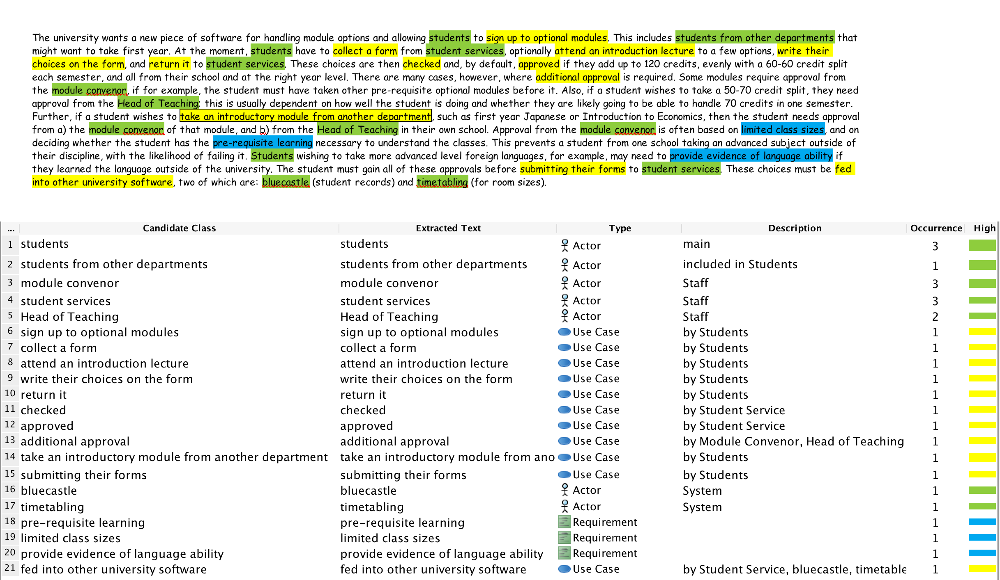

## Textual Analysis
From the textual analysis, we need to determine all the people that will use the system, which are stakeholders. There are mainly four types of stakeholders:

 - **Students( including students from other departments )**		
Students are the main users of this system, which are the most important stakeholders.
*Actions:*
&nbsp;&nbsp;1. sign up to optional modules
&nbsp;&nbsp;2. collect a form
&nbsp;&nbsp;3. attend an introduction lecture
&nbsp;&nbsp;4. write their choices on the form
&nbsp;&nbsp;5. take an introductory module from another department
&nbsp;&nbsp;6. return a form
&nbsp;&nbsp;7. provide evidence of language ability
&nbsp;&nbsp;8. submitting their forms

 - **Student Services**
 These are important ways for the communication between students and module convenors.
 - **Module Convenors**
 module convenors need to check the requirements from students and approve or reject them.
 *Actions:*
&nbsp;&nbsp;1. check
&nbsp;&nbsp;2. approve
&nbsp;&nbsp;3. additional approval
 - **Head of Teaching**
 They also need to check and make approvals for students.
 *Actions:*
&nbsp;&nbsp;1. check
&nbsp;&nbsp;2. approve
&nbsp;&nbsp;3. additional approval

