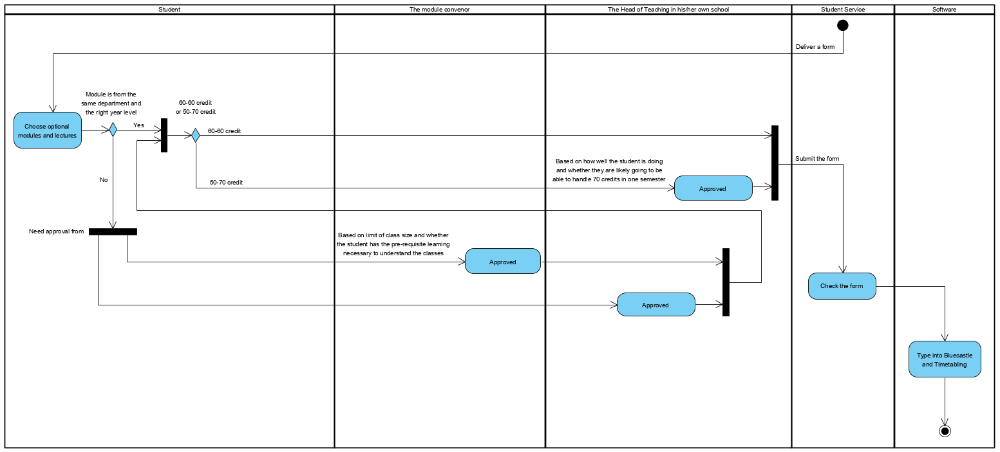
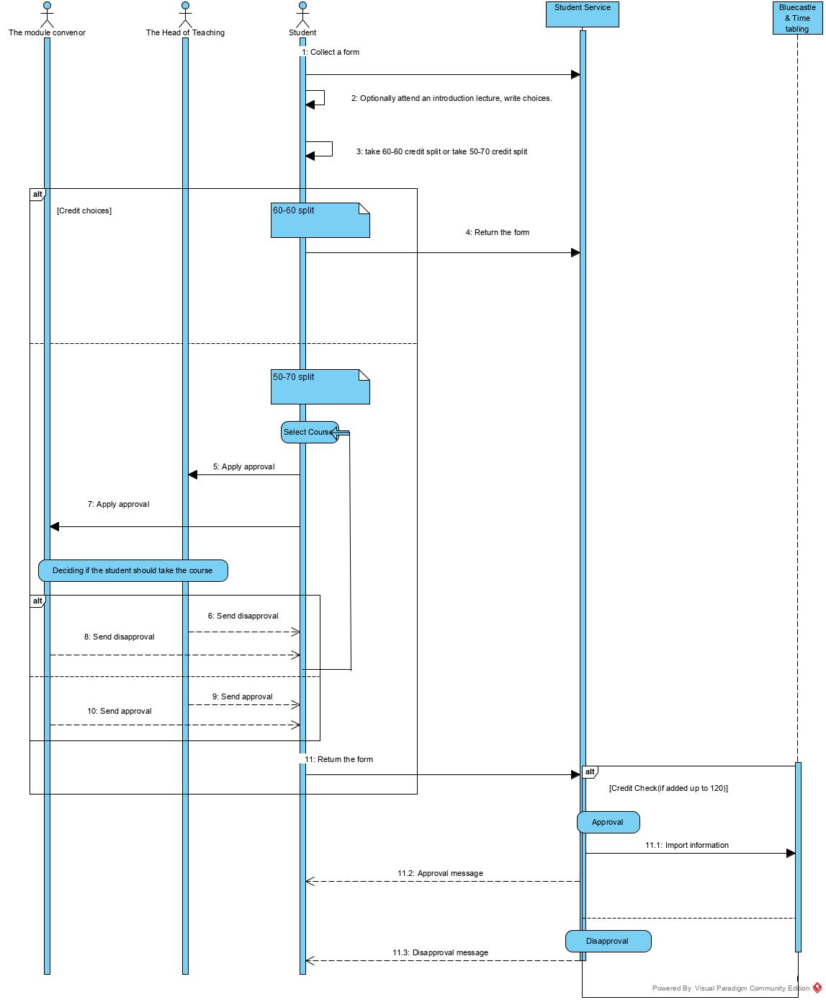

# **Lab3 Report**

------

- [Introduction](#introduction)

- [Activity Diagram](#activity-diagram)

- [Sequence Diagram](#sequence-diagram)

- [Workload Distribution](#workload-distribution)

  

## **Introduction**

------

In today's lab, our team managed to produce an **Activity Diagram** and  a **Sequence Diagram** for the **Module Selection Process of UNNC**. By analyzing the text and setting up the chart, we have a better understanding of how to use UML for modeling and git for teamwork.

## **Activity Diagram**

------

It is produced in this way because it is clear and easy to understand what will happen, options to be chosen and criteria to be considered. In addition, as the process is broken down into **different events conducted by corresponding actor** and **the beginning/end of the process is clearly displayed**, Activity Diagram provides **an ordered action chain** where elements are logically mixed and redundancy is avoided as much as possible.

### Action Diagram of Modules Selection System:

**Keynotes**

whether students select modules from other departments is considered first in this diagram(used in the first decision node), however, it is also feasible if checking credit split is placed first.  The diagram follows the "top to bottom, left to right" principle which is more readable.

## **Sequence Diagram**

------

The idea from the textual analysis is too abstract to be processed by human brain directly, therefore, it is usually, in fact, almost all the time, helpful to produce some diagrams to clear things up. By creating a Sequence Diagram, we can clearly distinguish all the **objects that will be involved in the process** when the system is in action, as well as the **relationship between the users and the systems**. The order of every event that might occur could also be visualized using a Sequence Diagram.

### Sequence Diagram of Modules Selection System:

**Notes**

If we are aiming at building a system that can handle all the requests from the students, is it still necessary that the student doing direct contact and asking approval from Head of Teaching and Module Convenors whatsoever? Since all these activity can be done using the software we are going to build, (or imagine building). The questions raised when the diagrams was found all about the **process of how the registration was done at current moment**, not how we imagine the **structure of processing events** to be when the software is implemented.

## **Workload Distribution**

------

- Textual Analysis from Yuyang LIN, Rongze LI
- Activity Diagram from Zhihao LI, Wangkai JIN
- Sequence Diagram from Yizhou CHEN, Qicheng CHEN
- Lab03 Report from all members