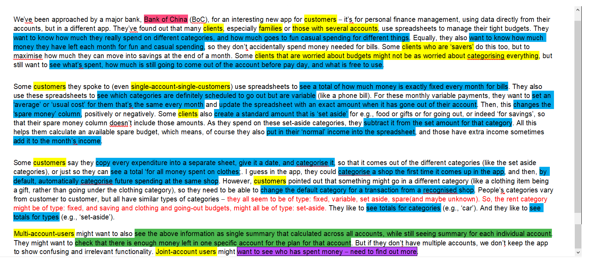
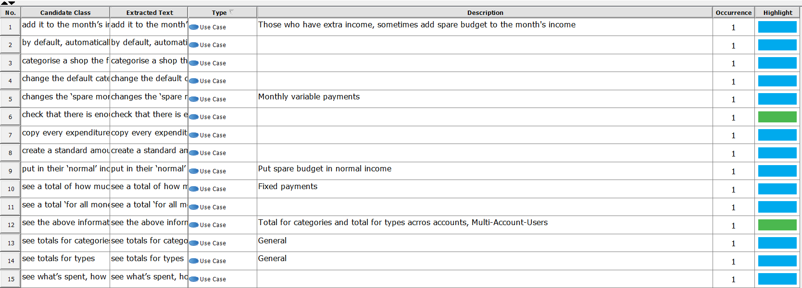

## **Financial Management  Application Requirements**

------

[Back to README](../../README.md)

- [Introduction](#introduction)
- [Textual Analysis](#textual-analysis) from Qicheng CHEN
- [Persona](#persona) from Zhihao LI,Yuyang LIN, Wangkai JIN
- [Use Case Diagram](#use-case-diagram) from Rongze LI, Yizhou CHEN

## **Introduction**

------

### **1.1Intro**

The application of personal financial management is an application embedded in users' electronic equipments. It eases the tasks of anyone who is in need of managing their assets and fund flow with a  convenient application,

### **1.2 Purpose**

The main objective of this application is to provide a more practical solution for credit card owners to better record expenditure,  manage multi accounts and balance income and expense.

### **1.3 Intended User and Scope**

This product is designed to improve the national financial managing skills and attract clients for Bank of  China so the target group covers all the adults who own their own credit cards. By providing users various functionality to manage their credit card accounts and with proper promotion, Bank of China aims at promoting this application to  a nationwide application.

## **Textual Analysis**

------

Textual Analysis is always what we need to start with, by doing that, we can facilitate all the following tasks. Through highlighting actors, use cases, information that we need afterwards will become much easier to find. It saves a bunch of time from reading the brief over and over and over again to look for objects.

 **Actors:**

 - **Clients(Customers)(yellow)**: Primary Stakeholders There are three general actors which can be specified by their aim for financial management. The archetype for these nine specified  actors are summarized in the persona section.

   - Single-Account Customers
     - Customers that care about category to maximize savings (including savers)
      - Customers that only care about category to manage budget
      - Customers that only care about what is spent	

   - Multi-Account Customers

     - Customers that care about category to maximize savings (including savers)
     - Customers that only care about category to manage budget
     - Customers that only care about what is spent	

   - Joint-Account Customers
     - Customers that care about category to maximize savings (including savers)
     - Customers that only care about category to manage budget
     - Customers that only care about what is spent

 - **Bank of China(red)**: Secondary Stakeholders 
   - It possesses the date and account information of the user.
   - Accessed by user with their own accounts
   - One of the biggest bank in China

 **Use Cases**: 

 - **General Customers**: Colored in Blue
 - **Multi-Account Customers**: Colored in Islamic Green
 - **Joint-Account Customers**: Colored in Magenta

 **Annotated Brief**

 **Extracted Texts**

## **Persona**

------

- [Persona for Single-account-user](singleaccountpersona.md)

- [Persona for Multi-account-user](multiaccountpersona.md)

- [Persona for Joint-account-user](jiont.md)

  

   	​	As we are discussing about how to develop an application to change the potential users' money managing habit(from using spreadsheet to using our application), the case study of our target people and their current preferences and habits are important for building our products' requirements and features. In this case, we firstly choose persona to be the first step of our requirement elicitation and analysis as it provides us some detailed pictures about what situation is users in and what our product can help them better solve the problem.
​	Persona represents a real type of user from stakeholders, according to textual analysis in the previous section, there are three general types of account owner, which are single-account customers, multi-account customers, and joint-account customers. And each kind of the customers can then divided into three more specified actors, by studying the features about these type of actors, we can generate the requirements which our product One is the type that want to categorize the fund flow and  know the exact amount of each category, another one is called "saver" who want almost same thing of the first one but with the purpose of maxmizing their savings and the final type is the one that only care about the total amount of money with our specified categories. So in total there are **9** persona. After analysing  these persona, we have a first hand information about them. In  the next section, we are going to look through use case diagram where  the interactions between actors and application is strengthened,
## **Use Case Diagram**

------

### Introduction
This diagram mainly introduce the use case of the designed software. It is used to illustrate the relationship between client and software.

### Description
**BoC** can be considered as the data center to provide the **client data** to the customers. The customers can be categorized three main kinds by account kind: **single account customer**, **multi-account customers** and **joint account customer**. They can go through data sent from **BoC** through **spreadsheets** on the **application** developed by us. The functions of the application differ according to different account kind. Most functions, managing money or customizing categories of money for checking, are the same for each account kind, i.e. functions for all account kinds, while some functions are specially designed for multi-customer and joint account customer, such as check summary of each account, which is designed for multi-account customers. The functions designed for all account kinds will be further explained in **Reasoning** part.

### Reasoning
This application makes it more convenient for customers to manage their budgets. Functions are designed by will, **using spreadsheets to categorize monthly payment** clearly, so that budgets for different wishes could be managed perfectly. Whether it's managing spare cash, or checking monthly fixed and current bills, the app can help. **Customizing product categories in the shop**, so that demands for different customers could be fitted.

### **Functional Requirements**

- It should provide use different categories for user to record different usage of money
- It should provide different functionality for user to customize their setting for financial managements
- It should calculate total amount of money and different budgets
- It should provide platform for multi-account user to check their accounts' information easily and a single summary of all the account
- It should provide single-account user a simplified service without confusing functionalities
- It should provide joint-account user a payment history for tracking who use the money

### **Non-Functional Requirements**

- **Safety Requirements**: If there is unexpected damage to the database of the account system, the recovery method restores a past copy of the database that was backed up to archival storage so that the system will be recovered up to the time before failure
- **Security Requirements**: Security systems need database storage just like many other applications. However, the special requirements of the security market mean that vendors must choose their database partner carefully.