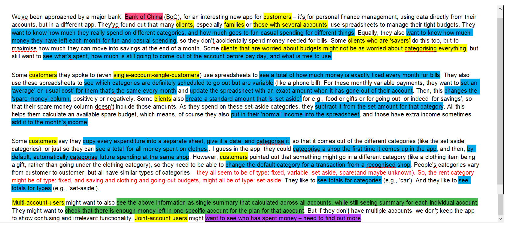
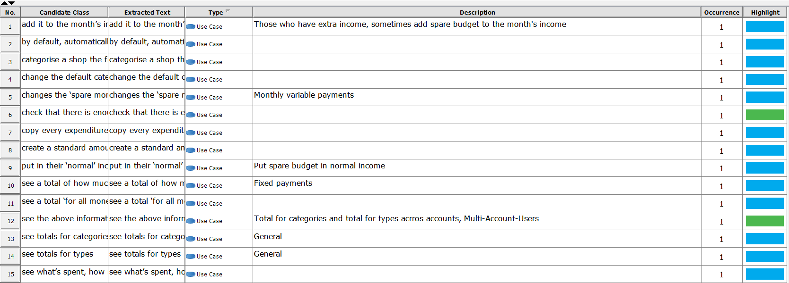
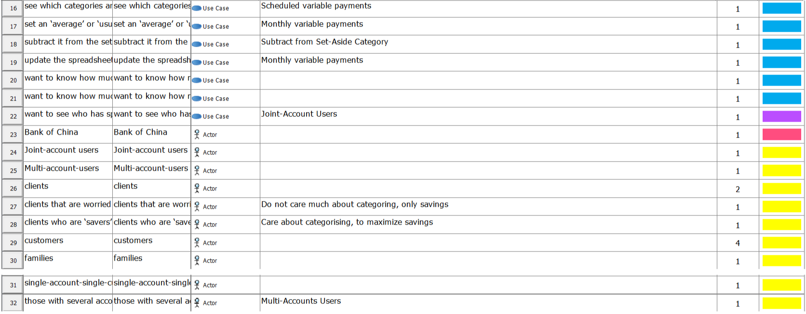

# Textual Analysis
Textual Analysis is always what we need to start with, by doing that, we can facilitate all the following tasks. Through highligting actors, use cases, information that we need afterwards will become much easier to find. It saves a bunch of time from reading the brief over and over and over and over again to look for objects.

 **Actors:**
 - **Clients(Customers)(Yellow)**: Primary Stakeholders, the more it is indented, more precise it is going to be, generally typified as follow:
    - Single-Account Customers
    		- Customers that care about category to maximize savings (including savers)
        - Customers that only care about category to manage budget
        - Customers that only care about what is spent	

    - Multi-Account Customers

        - Customers that care about category to maximize savings (including savers)
        - Customers that only care about category to manage budget
        - Customers that only care about what is spent	

    - Joint-Account Customers
        - Customers that care about category to maximize savings (including savers)
        - Customers that only care about category to manage budget
        - Customers that only care about what is spent
 - **Bank(red)**: Secondary Stakeholders  

    - Joint-Account Cusotmers
        - Families
        - Single Customers
            - Customers that care about category to maximize savings (including savers)
            - Customers that only care about category to manage budget
            - Customers that only care about what is spent
 - **Bank of China(Red)**: Secondary Stakeholders  

 **Use Cases**: 
 - **General Customers**: Colored in Blue
 - **Multi-Account Customers**: Colored in Islamic Green
 - **Joint-Account Customers**: Colored in Magenta

 **Annotated Brief**

 **Extracted Texts**

