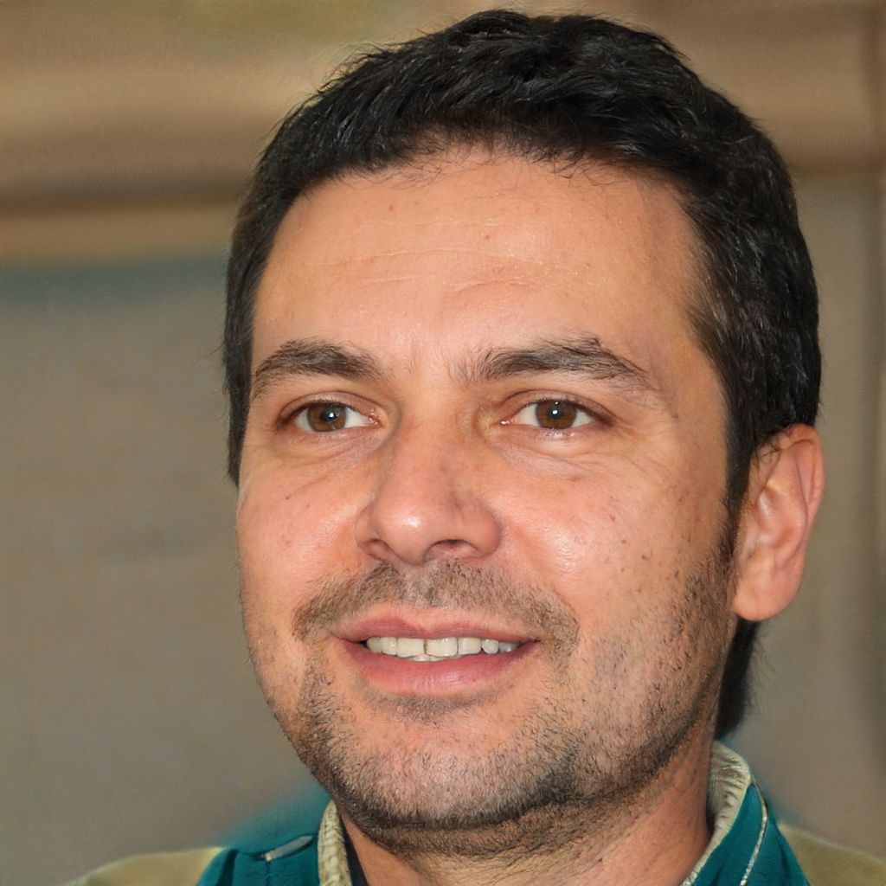

|   |  Oversea Staff | University Professor  | Local Entrepreneur  |
| ------------ | ------------ | ------------ | ------------ |
| Image  |   |   |   |
|  Fictional Name | Joseph Nelson  | Alexander Brown | Fugui Zhang  |
|  Job | Engineer  | Professor  | Entrepreneur  |
| Demographics  | - 27 years old - Single - Has a MsC in electronic engineering | - 36 years old - Married  - Father of one child  - Has a PhD in business   |  - 52 years old - Married  - Father of two children  - High-school graduation  |
| Location  | Beijing  | Shanghai  | Zhejiang  |
|  Annual Income (CNY)  | 800,000  | 1,000,000  | 2,000,000  |
| Environment   | He is graduated from university several years ago, and now working as a foreign engineer in an international company in China.   |  He is a business professor in the New York University, Shanghai, who has the experience in teaching for almost 10 years. Now he is living in Shanghai with his wife and daughter. They are still plan to live there. | He is a famous individual entrepreneur in his hometown, who has considerable property now. He has two children who are preparing to study abroad for a higher education.  |
|  Financial Management Goal  |Prepare money for further usage and maximise how much they can move into savings at the end of a month.  | Informed of general fund flow and plan for some investigations in China. Want to know how much they really spend on different categories  on different accounts, and finally demonstrated in one sheet.  | For the further investigation and make preparation for children studying abroad. The fund should be calculated across all accounts, while still seeing summary for each individual account.  |

[Back to report](Lab4report.md)