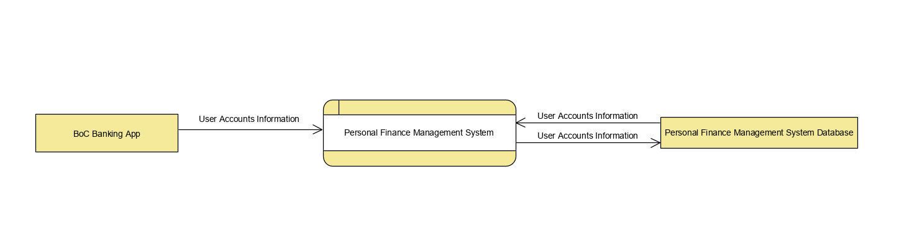

# Context Diagram
Context diagram shows the system that is to be developed, as a whole, the inputs and outputs from/to the system. The main goal of the diagram is to clarify all other external systems our system is going to interact with, i.e. the boundaries, as well as the data they will use to communicate, in doing so, we can know what we are going to develop, what we should focus on and what should not be developed.

In the brief, we can tell that the only external entity is the banking app of Bank of China, as it oringanlly state that the app takes data directly from the user accounts in another app. Implications extracted from this, is that generally, when the clients make an expense or a deposit, the banking app will inform the bank, then the bank update the user accounts, and then the banking app will send updated data to our app, which then update the data.

 *THIS IS THE REASON WHY WE END UP WITH A RIDICULOUSLY SIMPLE CONTEXT DIAGRAM LIKE THIS!:P*
