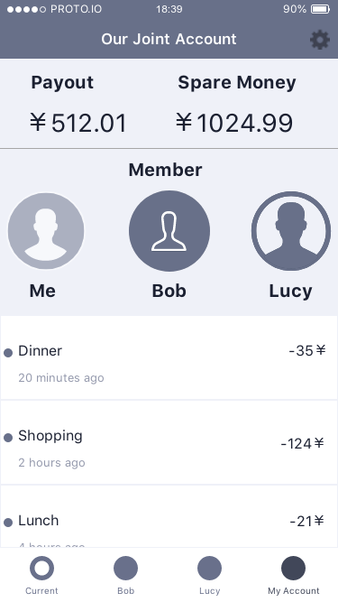
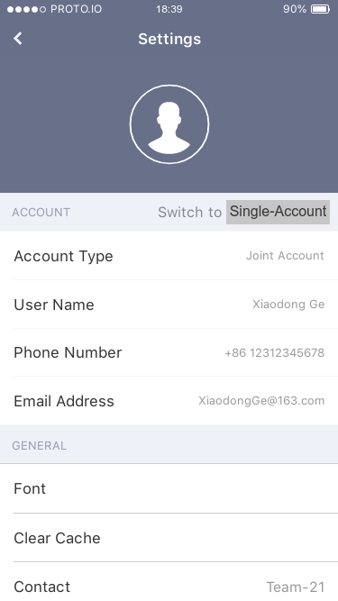

## **Specifications And Prototype For Finance Management Application**

------

[Back to README](../../README.md)

- [Introduction](#introduction) from Wangkai JIN
- [Activity Diagram](#activity-diagram) from Rongze LI, Yizhou CHEN
- [Context Diagram](#context-diagram) from Qicheng CHEN, Yuyang LIN
- [Prototype](#prototype) from Zhihao LI
- [Excluding Reasoning & Questions](#why-not) from Wangkai JIN

### **Introduction**

------

This report introduces the specifications of the Finance Management Application for Bank of China. The report will go through the demonstration of specifications linked to the requirements our team gathered last week ([click here](../Lab04/Lab4report.md) for the requirement report), display of Activity Diagram and Context Diagram which illustrate the work flow and inter-related system design, and also a prototype for better understanding.

Here are the functional requirements extracted from last week report:

1. It should provide use different categories for user to record different usage of money
2. It should provide different functionality for user to customize their setting for financial managements
3. It should calculate total amount of money and different budgets
4. It should provide platform for multi-account user to check their accounts' information easily and a single summary of all the account
5. It should provide single-account user a simplified service without confusing functionalities
6. It should provide joint-account user a payment history for tracking who use the money

First of all, the list of specifications are displayed below:

| Requirement ID | Specification                                                |
| -------------- | ------------------------------------------------------------ |
| 1              | A user shall be able to use the app to record money use      |
| 2              | A user shall be able to change the default setting and choose their own preference |
| 3              | A user shall be able to see the amount of money in their accounts and also the amount for different usage |
| 4              | A multi-account user shall be able to see his/her different accounts' info and the amount of money for all the accounts |
| 5              | A single-account user shall be able to choose a simplified version |
| 6              | A joint-account user shall be able to check the payment history |

### **Activity Diagram**

------

**Introduction**

------

This Activity Diagram mainly describes the work flow of the application specifically.

**Description**:

-----

This Activity Diagram converts requirements of the project into the specification of application, also merges demands from customers into functions. The Reasoning Part gives a comprehensive explanation of the diagram.

**Reasoning**:

-----

- Reasoning for choosing Activity Diagram:

*`Choosing Activity Diagram for the specification of designing this app is a proper choice and reasons are listed below.`*

1. To specify how an application works, it's significant to **make it, the working process, main involved functions, parallel threads etc., very clear and readable.** **Exhaustive work flow** in the Activity Diagram is what exactly expected. 

2. Activity Diagram is usually used for **integrating or tying together Use Cases.** It's suitable for our work.

3. **Fundamental elements** in the Activity Diagram facilitate the description of specification (e.g. bars representing the start or end of concurrent activities).

- Reasoning for the details of work flow:

*`Further explanation of the workflow in the Activity Diagram`*

1. **Parallel threads** works for different account kinds. Main functions are the same for all accounts, while several additional functions are specially for multi-account or joint-account customers. Two-side threads are therefore designed for additional functions, while a main thread is designed for main functions. 

2. **Breakdown of monthly spending** is designed for the group of people who are willing to check monthly spending through spreadsheets.

3. **Default category and Customized category** satisfy convenience and user customization.

4. **Category based on labels** is designed for user customization. Due to coexistence of similar types of categories among customers and personalized categories, different labels will be tagged on every bill. Specifically, labels differ from different types of categories, (e.g. fixed, variable, set-aside, spare money are categorized based on variability of bills), which facilitates the management of budget.

   

### **Context Diagram**

------

**Introduction**

------

The context diagram mainly shows the **relationship** between different entities.

------

**Reasoning**:

The context diagram shows the boundary  between each system, and how entities *interact* with it. The application is placed in the middle of the diagram without details of  the inferior structure. Through building up the Context Diagram, we have divided the systems that the software requires into different functionalities. It could help our clients have a  general understanding of the features and the systems that consists of the whole application.
By using the diagram, each functionality of the systems of the application can be demonstrated.
Four main parts are shown below. 

1.  There is a main **database** to store all the information of user accounts.

2.  Also, the **account management system** allows the user to switch from different account and display the account situation of multiple accounts.

3.  The **categorizing system** can make categories for different user expense.

4.  And **calculating system** can give the user what amount of money do they spend during a month or the total year. 

### **Prototype**

------

**Preview of Bank App**

You can watch the preview of Bank App by [Bank App](https://pr.to/1C6NN3/) or the link https://pr.to/1C6NN3/

**Guide**

The beginning interface will be seen first, tap Enter button to continue.

 Here comes the screen of single account. You can view the line chart of your asset between the last seven months. In each month, the payout is indicated and you can check the remain money compared by your monthly budget (+remain / -overdraft) as well.  You can view the summary mode by tapping the aim point in the upper right, and come back by tapping the same button.  

There are three buttons on the bottom, Home (the line chart showed above), Category and Multi-Account. Main categories are listed in the Category and you can check the payout of every category.   In Multi-Account page(below) you can see a line chart of total asset and every specific account can be checked by choosing different account.    In the upper right there is a setting button, there you can switch to your Joint-Account by tapping the button named *Joint-Account*. You can also check your account type, user name, phone number and email address as well.   Here comes the Joint-Account. There are four buttons on the bottom, which are current and three member's accounts. In the current button, you can check the total payout, total spare money and current events of every member.  You can view every member's account by tapping the corresponding buttons on the bottom.     If you want to switch to your own account, you can tap the setting button in the upper right and tap the button named *Single-Account*.  

**That's all for the prototype and our software specifications!**

## **Why NOT choosing Scenario or Sequence Diagram**

------

**Scenario**: Scenario is a structured description of the process not just a story. It has many advantages like **defining the plot, goal of objectives of the user and document each use case in specific details**. However, if using scenarios for our specification presentation, it may **overlap the function of requirement gathering** task which we have already completed last week. Also, clients may fail to read paragraphs of text and grab the main idea in a short period,especially during a meeting. Instead, an activity diagram or prototype which either **demonstrates the word flow clearly** or **shows the partial final product's functionality** can help the client to understand the product and its inner mechanism quickly. Therefore, the **efficiency** of the meeting is enhanced.

**Sequence Diagram**: Sequence Diagram captures the high-level interactions between user of the system and system, between the system and other system, or between subsystems. It emphasizes **"interaction"**, while for our case, we want to put **"work flow and functionality"** a higher priority. Also for this application, the objects are quite few. Though intense interactions do exist between user and the financial management system, our team believe Activity Diagram and Prototype can better reach our goal.

## **Questions** for Clients

------

- Does the application have some similarities to the competing products available in the market? If so, could you list them?
- In your opinion, What is the unique feature of this application that may attract user and maintain user stickiness?
- Does this application provide user a better tool to manage their bank accounts and make financial plans?
- What are the defects for this version? What new features do you expect to be updated in the next version?
- Rate from 1 to 10, what is the score for you to recommend your friends/relatives to use this application?